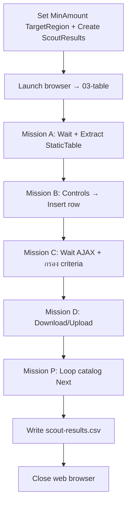

# Lab 03 — Web Scout (ความรู้)

**หน้าปก:** [README.md](README.md) · **ลงมือทำ:** [LAB.md](LAB.md) · **พื้นฐานร่วม:** [`shared/PAD-FUNDAMENTALS.md`](../../shared/PAD-FUNDAMENTALS.md)

**วัน:** 1 · **ระดับ:** Intermediate · **อ่านประมาณ:** 20–30 นาที

## 1. บทนี้เรียนอะไร / จบแล้วทำอะไรได้

เมื่อจบบทนี้ คุณจะ:

- อธิบายรูปแบบ **Web Scout** — เก็บหลักฐานจากหลายหน้าบน Lab Hub ลง Data table แล้วส่งออก CSV
- แยก **ตาราง static** กับ **ตาราง AJAX** และรู้ว่าทำไมต้อง **Wait for web page content** ก่อน Extract
- ใช้ controls บนเว็บ (dropdown/checkbox), download/upload ไฟล์ และวนหน้า catalog ด้วยปุ่ม Next
- กรองแถวตาม criteria (`MinAmount`, `TargetRegion`) แล้ว mark ใน `Matched` / `Notes`
- เข้าใจกฎ `%` ตอนสร้างชื่อตัวแปร vs ตอนอ้างอิงค่า

## 2. เรื่องราวจากงานจริง

ทีม operations ได้รับภารกิจ “ลาดตระเวน” เว็บภายใน: ดึงตารางออเดอร์ ตรวจ controls รอข้อมูลที่โหลดช้า ดาวน์โหลดไฟล์ตัวอย่าง แล้วสรุปผลเป็น CSV ให้เปิดใน Excel ได้  
ถ้าทำมือทีละหน้าจะพลาดเกณฑ์กรองและไม่มีหลักฐานครบ งานของบทนี้คือสร้าง **desktop flow** ชื่อแนว Scout ที่เก็บแถวลง `%ScoutResults%` จาก Mission A–D (และ catalog หลายหน้า) แล้วเขียน `scout-results.csv`

## 3. ศัพท์ทีละคำ

| ศัพท์ | ความหมายภาษาคน | เห็นที่ไหนใน PAD |
|--------|----------------|------------------|
| **Scout / Mission** | งานย่อยแต่ละหน้า (A static, C AJAX, …) | โครง Lab / SourcePage ใน CSV |
| **Extract data from web page** | ดึงตารางหรือข้อความจากหน้า | live web helper |
| **Data table** | ตารางในหน่วยความจำหลายคอลัมน์ | `ScoutResults`, `StaticTable`, `Products` |
| **AJAX table** | ตารางที่แถวโผล่หลังโหลดแบบ async | หน้า `09-ajax-table` |
| **Criteria** | เกณฑ์กรอง เช่น Amount ≥ 10000, Region = BKK | `scout-criteria.csv` |
| **Go to web page** | เปลี่ยน URL ในเบราว์เซอร์เดิม | หลัง Launch ครั้งแรก |
| **Set current iframe** | สลับเข้าเฟรมซ้อนก่อน Interact | Mission E |
| **Loop + Next** | วนหน้า catalog จนปุ่ม Next disabled | Mission P (`19-catalog`) |

## 4. แนวคิดหลัก

แนวคิดสำคัญ: **เปิดเบราว์เซอร์ครั้งเดียว → ไปทีละ Mission → Wait → Extract/Interact → Insert ลง ScoutResults → เขียน CSV → ปิดเบราว์เซอร์**  
อย่า hardcode แถวที่ 1–2 — วนจาก Data table ที่ extract ได้



Pseudo-flow:

```text
MinAmount = 10000, TargetRegion = BKK
ScoutResults = data table ตาม template
Browser = Launch → 03-table.html
A: Wait → Extract StaticTable → For each Insert ลง ScoutResults
B: Go 02-controls → Set dropdown/checkbox → Insert row
C: Go 09-ajax → Wait แถว → Extract AjaxTable → If ผ่าน criteria → Insert (PRIORITY HIT)
D: Go 05-files → Download/Upload → Insert + เก็บ path
P: Go 19-catalog → Extract + Loop Click Next จน ~24 รายการ
เขียน C:\PAD-Labs\output\lab03\scout-results.csv แล้ว Close %Browser%
```

## 5. ตาราง Action ที่จะใช้

| Action (official) | ทำอะไร | Input สำคัญ | Produced (ชื่อตอนสร้าง — ไม่มี `%`) |
|-------------------|--------|-------------|--------------------------------------|
| **Set variable** | ตั้ง criteria / path | Name, Value | — |
| **Create new data table** | สร้างตารางผล Scout | คอลัมน์ตาม template | `ScoutResults` |
| **Launch new Microsoft Edge** / **Chrome** | เปิดเบราว์เซอร์ | Initial URL | `Browser` |
| **Go to web page** | ไปหน้า Mission ถัดไป | Browser, URL | — |
| **Wait for web page content** | รอตาราง/control พร้อม | Browser, element | — |
| **Extract data from web page** | ดึงตาราง | Browser, live web helper | `StaticTable`, `AjaxTable`, `Products` |
| **For each** | วนแถวตาราง | Value to iterate, Store into | Store into = `StaticRow` / `AjaxRow` |
| **Insert row into data table** | เพิ่มแถวผล | ตารางปลายทาง, ค่าคอลัมน์ | — |
| **Set drop-down list value on web page** | เลือก dropdown | Browser, UI element | — |
| **Set check box state on web page** | ตั้ง checkbox | Browser, UI element | — |
| **If** | กรอง Amount / Region | เงื่อนไข | — |
| **Click link / Press button on web page** | Download หรือ Next page | Browser, UI element | — |
| **Set current iframe** | เข้า nested form | Browser, iframe | — |
| **Invoke web service** | เรียก HTTP (Mission F) | URL, method | ตามที่ designer มี |
| **Loop condition** | วนหน้า catalog | เงื่อนไข Next | — |
| **Write text to file** | เขียน CSV | File path, Text | — |
| **Close web browser** | ปิดเบราว์เซอร์ | `%Browser%` | — |

## 6. เปรียบเทียบตัวเลือกที่มักสับสน

| หัวข้อ | ตัวเลือก A | ตัวเลือก B | เลือกเมื่อไหร่ |
|--------|------------|------------|----------------|
| ตาราง | Static (`03-table`) | AJAX (`09-ajax-table`) | AJAX **ต้อง Wait จนมีแถว** ก่อน Extract |
| เก็บแถว | วน **For each** จาก Data table | Hardcode แถวที่ 1–2 | ห้าม hardcode index แบบเปราะ |
| เปลี่ยนหน้า | **Go to web page** ใน Browser เดิม | Launch ใหม่ทุก Mission | ใช้ Go to หลัง Launch ครั้งแรก |
| Iframe | **Set current iframe** แล้ว Populate | กรอกที่ parent ทันที | ต้องสลับเฟรมก่อน Interact |
| Catalog | Loop + Click Next จน disabled | Extract หน้าเดียว | Mission P ต้องการ ~24 รายการจาก 3 หน้า |

## 7. กฎ `%` และ Variables pane

- ช่อง **Name** / **Store into** / ชื่อ produced → พิมพ์ `ScoutResults`, `StaticRow`, `MinAmount` (**ไม่มี `%`**)
- ช่อง Browser / Value to iterate / เงื่อนไข If → `%Browser%`, `%AjaxTable%`, `%MinAmount%` (**มี `%`**)
- รายละเอียดเต็ม: [`shared/PAD-FUNDAMENTALS.md`](../../shared/PAD-FUNDAMENTALS.md)

## 8. จุดที่มือใหม่พลาดบ่อย

| อาการ | สาเหตุที่พบบ่อย | วิธีสังเกต |
|-------|-----------------|------------|
| AJAX ว่าง | Extract ทันทีหลัง Go to | Variables pane: ตาราง 0 แถว |
| CSV ไม่ครบ SourcePage | ข้าม Mission หรือลืม Insert | เปิด scout-results.csv ตรวจคอลัมน์ |
| Mission D ไม่ผ่าน | ไม่มีไฟล์ใน `downloads\` | โฟลเดอร์ว่างหลัง Run |
| Catalog หยุดหน้า 1 | ไม่ Loop Next / ไม่รอตารางใหม่ | นับรายการน้อยกว่า ~24 |
| Iframe กรอกไม่ได้ | ยังอยู่ parent frame | Set current iframe ก่อน Populate |

## 9. คำถามทบทวน

**1.** ก่อน **Extract data from web page** บนหน้า AJAX ควรทำอะไร?

<details>
<summary>เฉลย</summary>
ใช้ <strong>Wait for web page content</strong> จนมีแถวข้อมูล — ไม่ใช้ Wait วินาทีอย่างเดียวเป็นเกณฑ์หลัก
</details>

**2.** ทำไมไม่ควร hardcode แถวที่ 1–2 หลัง Extract?

<details>
<summary>เฉลย</summary>
จำนวน/ลำดับแถวอาจเปลี่ยน — ควรววนด้วย <strong>For each</strong> จาก Data table ที่ extract ได้แล้ว Insert ลง <code>ScoutResults</code>
</details>

**3.** `%MinAmount%` กับ Name `MinAmount` ต่างกันอย่างไร?

<details>
<summary>เฉลย</summary>
ตอนสร้างด้วย Set variable ช่อง Name = <code>MinAmount</code> (ไม่มี <code>%</code>); ตอนเปรียบเทียบใน If ใช้อ้างอิง <code>%MinAmount%</code>
</details>

**4.** Mission P จบเมื่อไร?

<details>
<summary>เฉลย</summary>
เมื่อปุ่ม Next (<code>#btn-next-page</code>) <strong>disabled</strong> หลังวนครบประมาณ 3 หน้า (~24 รายการ) — ต้อง Wait ตารางทุกหน้าหลังคลิก Next
</details>

**5.** ท้าย flow ต้องมี action ใดเกี่ยวกับเบราว์เซอร์?

<details>
<summary>เฉลย</summary>
<strong>Close web browser</strong> ด้วย <code>%Browser%</code> หลังเขียน <code>scout-results.csv</code>
</details>

## 10. อ้างอิง (Aug 2026)

| แหล่ง | URL |
|-------|-----|
| Web automation | https://learn.microsoft.com/power-automate/desktop-flows/automation-web |
| Web actions | https://learn.microsoft.com/power-automate/desktop-flows/actions-reference/webautomation |
| Desktop flow coding guidelines | https://learn.microsoft.com/power-automate/guidance/desktop-flow-coding-guidelines/ |
| รายการแหล่งใน Lab Kit | [`shared/SOURCES-AUG2026.md`](../../shared/SOURCES-AUG2026.md) |

---

**ถัดไป:** เปิด [LAB.md](LAB.md) แล้วทำ Hands-on ทีละขั้น
