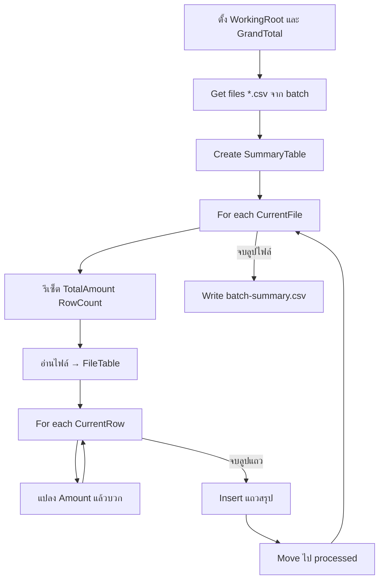

# Lab 05 — Looping Files / Data (ความรู้)

**หน้าปก:** [README.md](README.md) · **ลงมือทำ:** [LAB.md](LAB.md) · **พื้นฐานร่วม:** [`shared/PAD-FUNDAMENTALS.md`](../../shared/PAD-FUNDAMENTALS.md)

**วัน:** 2 · **ระดับ:** Intermediate · **อ่านประมาณ:** 15–25 นาที

## 1. บทนี้เรียนอะไร / จบแล้วทำอะไรได้

เมื่อจบบทนี้ คุณจะ:

- ประมวลผลไฟล์ CSV หลายไฟล์แบบ batch ด้วย **For each** ชั้นนอก
- วนแถวใน Data table ด้วย **For each** ชั้นในเพื่อรวม `Amount`
- สร้างตารางสรุปด้วย **Create new data table** + **Insert row into data table**
- ย้ายไฟล์ที่ทำเสร็จไป `processed\` และเขียน `batch-summary.csv`
- เข้าใจว่าทำไมห้าม hardcode อ่าน `batch-01` / `02` / `03` เป็น 3 ชุด action แยก

## 2. เรื่องราวจากงานจริง

สมมติทีมขายส่งไฟล์คำสั่งซื้อมาเป็นชุดทุกเย็น: `batch-01.csv`, `batch-02.csv`, `batch-03.csv` แต่ละไฟล์มีหลายออเดอร์และคอลัมน์ `Amount`  
ถ้าเปิดทีละไฟล์ใน Excel แล้วบวคมือ จะช้าและพลาดยอดได้ง่าย งานของบทนี้คือสร้าง **desktop flow** ที่วนทุกไฟล์ในโฟลเดอร์ `batch` รวมยอดต่อไฟล์ ใส่แถวสรุป ย้ายไฟล์ไป `processed` แล้วเขียนรายงานเดียวที่ยอดรวมต้องได้ **46500**

## 3. ศัพท์ทีละคำ

| ศัพท์ | ความหมายภาษาคน | เห็นที่ไหนใน PAD |
|--------|----------------|------------------|
| **Batch** | ชุดไฟล์ที่ประมวลผลด้วยกัน | โฟลเดอร์ `batch\` |
| **For each (nested)** | ลูปซ้อน — ไฟล์นอก / แถวใน | Actions → Loops |
| **Data table** | ตารางในหน่วยความจำของ flow | Create new data table |
| **Data row** | แถวหนึ่งในตาราง | Store into ของ For each บนตาราง |
| **Aggregate** | รวมค่า (เช่น บวก Amount) | Increase / นิพจน์ `%A% + %B%` |
| **Grand total** | ยอดรวมทุกไฟล์ | ตัวแปร `GrandTotal` |
| **Processed** | โฟลเดอร์เก็บไฟล์ที่ทำเสร็จแล้ว | `Move file(s)` ไป `processed\` |
| **Loop condition** | ลูปจนเงื่อนไขเป็นจริง (challenge) | Do until / Loop condition |

## 4. แนวคิดหลัก

แนวคิดสำคัญ: **หนึ่งลูปต่อหนึ่งไฟล์ → ลูปซ้อนต่อหนึ่งแถว → สรุปต่อไฟล์ → รวม GrandTotal**

อย่านับแถว header เป็นออเดอร์ และแปลง Amount เป็นตัวเลขก่อนบวก



Pseudo-flow:

```text
WorkingRoot = C:\PAD-Labs\working\lab05
GrandTotal = 0
สร้างโฟลเดอร์ processed (ถ้ายังไม่มี)
BatchFiles = ไฟล์ *.csv ใน WorkingRoot\batch
สร้าง SummaryTable คอลัมน์ FileName, RowCount, TotalAmount
สำหรับแต่ละ CurrentFile ใน BatchFiles:
  TotalAmount = 0; RowCount = 0
  อ่านไฟล์ → FileTable (ข้าม header)
  สำหรับแต่ละ CurrentRow ใน FileTable:
    AmountNumber = แปลง Amount เป็นตัวเลข
    TotalAmount += AmountNumber
    RowCount++
  Insert แถวลง SummaryTable
  GrandTotal += TotalAmount
  Move CurrentFile → processed\
เขียน batch-summary.csv
ตรวจ GrandTotal = 46500
```

## 5. ตาราง Action ที่จะใช้

| Action (official) | ทำอะไร | Input สำคัญ | Produced (ชื่อตอนสร้าง — ไม่มี `%`) |
|-------------------|--------|-------------|--------------------------------------|
| **Set variable** | ตั้ง path / ตัวรวม / รีเซ็ตต่อไฟล์ | Name, Value | — |
| **If folder exists** | ตรวจ `processed` | Folder path | — |
| **Create folder** | สร้าง `processed` | Folder name, Into | — |
| **Get files in folder** | ดึงรายการ CSV | Folder, `*.csv` | `BatchFiles` |
| **Create new data table** | ตารางสรุป | ชื่อคอลัมน์ | `SummaryTable` |
| **For each** | วนไฟล์ / วนแถว | Value to iterate, Store into | `CurrentFile` / `CurrentRow` |
| **Get file path part** | ได้ชื่อไฟล์ | File path | `FileName` |
| **Read text from file** / **Launch Excel** + **Read from Excel worksheet** | อ่าน CSV เป็นตาราง | File / Worksheet | `FileTable` |
| **Convert text to number** | แปลง Amount | Text | `AmountNumber` |
| **Increase variable** | บวกตัวนับ / ยอด | ตัวแปรตัวเลข | — |
| **Insert row into data table** | เพิ่มแถวสรุป | Data table, ค่าคอลัมน์ | — |
| **Move file(s)** | ย้ายไป processed | File(s), Destination | — |
| **Write text to file** | เขียน CSV สรุป | File path, Text | — |
| **Loop condition** (challenge) | รอจนเงื่อนไข | Condition | — |

## 6. เปรียบเทียบตัวเลือกที่มักสับสน

| หัวข้อ | ตัวเลือก A | ตัวเลือก B | เลือกเมื่อไหร่ |
|--------|------------|------------|----------------|
| อ่าน 3 ไฟล์ | **For each** บน `%BatchFiles%` | 3 ชุด action hardcode | ต้องใช้ลูป — hardcode ไม่ผ่านเกณฑ์ |
| ลูปชั้นใน | `%FileTable%` → `CurrentRow` | วนทั้ง `%BatchFiles%` อีกครั้ง | ชั้นในต้องเป็นแถวของไฟล์ปัจจุบัน |
| Amount | บวกข้อความตรง ๆ | **Convert text to number** ก่อน | แปลงก่อนรวมเสมอถ้าเป็น text |
| Header | นับเป็นแถว order | Skip first line / column names | อย่านับ header |
| หลังประมวลผล | **Move** ไป processed | ปล่อยไว้ใน batch | Lab ต้องการ marker ที่ processed |

## 7. กฎ `%` และ Variables pane

- ช่อง **Name** / **Store into** / ชื่อ produced → `WorkingRoot`, `BatchFiles`, `SummaryTable`, `AmountNumber` (**ไม่มี `%`**)
- ช่อง iterate / path / นิพจน์บวก → `%BatchFiles%`, `%CurrentRow%['Amount']`, `%GrandTotal% + %TotalAmount%` (**มี `%`**)
- รายละเอียดเต็ม: [`shared/PAD-FUNDAMENTALS.md`](../../shared/PAD-FUNDAMENTALS.md)

## 8. จุดที่มือใหม่พลาดบ่อย

| อาการ | สาเหตุที่พบบ่อย | วิธีสังเกต |
|-------|-----------------|------------|
| GrandTotal ≠ 46500 | ข้ามไฟล์ / นับ header / ไม่แปลงตัวเลข | เทียบแถว expected ทีละไฟล์ |
| Summary ว่าง | Insert row อยู่นอกลูปไฟล์ หรือก่อนรวมแถว | ดูตำแหน่ง Insert ใน workspace |
| Amount บวกไม่ได้ | ยังเป็น text | ใช้ **Convert text to number** |
| batch ว่างหลังรัน | ใช้ Move แล้ว | กู้จาก `assets/batch` ก่อนรันซ้ำ |
| RowCount เกินจริง | นับแถวหัวตาราง | เปิด Skip first line / column names |

## 9. คำถามทบทวน

**1.** ทำไม Lab นี้ห้ามอ่าน `batch-01` / `02` / `03` ด้วย 3 ชุด action แยกโดยไม่มีลูป?

<details>
<summary>เฉลย</summary>
เพราะเป้าหมายคือประมวลผลแบบ batch ที่ขยายได้ — ใช้ <strong>For each</strong> บนรายการจาก <strong>Get files in folder</strong> จะรองรับไฟล์เพิ่มโดยไม่แก้ flow
</details>

**2.** ยอดรวมที่คาดหวังของทั้งชุดคือเท่าไร และมาจากไฟล์ใดบ้าง?

<details>
<summary>เฉลย</summary>
<strong>46500</strong> จาก <code>batch-01</code> (20000) + <code>batch-02</code> (17500) + <code>batch-03</code> (9000)
</details>

**3.** ในลูปชั้นใน อ่าน Amount จากแถวอย่างไร และถ้าเป็นข้อความต้องทำอะไร?

<details>
<summary>เฉลย</summary>
อ่านจาก <code>%CurrentRow%['Amount']</code> (หรือชื่อคอลัมน์จริง) แล้วใช้ <strong>Convert text to number</strong> ได้ produced เช่น <code>AmountNumber</code> ก่อนบวกเข้า <code>TotalAmount</code>
</details>

**4.** ช่อง Store into ของ **For each** ชั้นนอกควรเป็นชื่อแบบไหน?

<details>
<summary>เฉลย</summary>
พิมพ์ชื่อเปล่า เช่น <code>CurrentFile</code> — <strong>ไม่มี</strong> <code>%</code> (ตอนอ้างอิงค่อยใช้ <code>%CurrentFile%</code>)
</details>

**5.** Challenge **Loop condition** / Do until ต่างจาก **For each** อย่างไร?

<details>
<summary>เฉลย</summary>
<strong>For each</strong> วนตามจำนวนรายการที่มีอยู่แล้ว ส่วน <strong>Loop condition</strong> / Do until วนจนกว่าเงื่อนไขจะเป็นจริง (เช่น retry จนไฟล์มาถึงหรือครบจำนวนครั้ง) — ใน Lab เป็นทางเลือกฝึก ไม่บังคับผ่านเกณฑ์
</details>

## 10. อ้างอิง (Aug 2026)

| แหล่ง | URL |
|-------|-----|
| Folder actions | https://learn.microsoft.com/power-automate/desktop-flows/actions-reference/folder |
| File actions | https://learn.microsoft.com/power-automate/desktop-flows/actions-reference/file |
| Getting started (file pattern) | https://learn.microsoft.com/power-automate/desktop-flows/getting-started-freeorg |
| รายการแหล่งใน Lab Kit | [`shared/SOURCES-AUG2026.md`](../../shared/SOURCES-AUG2026.md) |

---

**ถัดไป:** เปิด [LAB.md](LAB.md) แล้วทำ Hands-on ทีละขั้น
