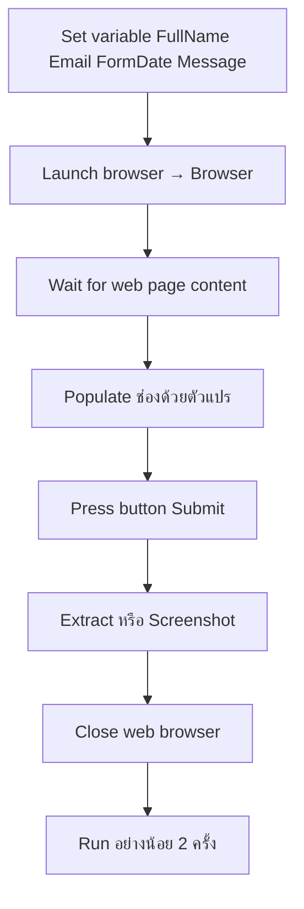

# Lab 01 — Record & Replay (ความรู้)

**หน้าปก:** [README.md](README.md) · **ลงมือทำ:** [LAB.md](LAB.md) · **พื้นฐานร่วม:** [`shared/PAD-FUNDAMENTALS.md`](../../shared/PAD-FUNDAMENTALS.md)

**วัน:** 1 · **ระดับ:** Beginner · **อ่านประมาณ:** 15–25 นาที

## 1. บทนี้เรียนอะไร / จบแล้วทำอะไรได้

เมื่อจบบทนี้ คุณจะ:

- อธิบายได้ว่า **Web Recorder** ช่วยจับขั้นตอนบนเว็บอย่างไร และทำไมต้องตรวจ UI Elements หลัง Record
- เปิดเบราว์เซอร์ด้วย **Launch new Microsoft Edge** / **Launch new Chrome** แล้วรอหน้าพร้อมด้วย **Wait for web page content**
- กรอกฟอร์มด้วย **Populate text field on web page** จากตัวแปร (ไม่ hardcode) แล้วกด Submit ด้วย **Press button on web page**
- เก็บหลักฐานสำเร็จด้วย **Extract data from web page** หรือ **Take screenshot of web page** แล้วปิดด้วย **Close web browser**
- เข้าใจกฎ `%` ตอนสร้างชื่อตัวแปร vs ตอนอ้างอิงค่า

## 2. เรื่องราวจากงานจริง

สมมติทีมบริการลูกค้าต้องกรอกฟอร์มติดต่อบนเว็บซ้ำ ๆ ทุกวัน — ชื่อ อีเมล วันที่ และข้อความ — แล้วกด Submit ให้ได้ข้อความยืนยัน  
ถ้าทำมือทุกครั้งจะช้าและพิมพ์ผิดได้ง่าย งานของบทนี้คือสร้าง **desktop flow** ที่เปิดหน้า [01 Forms](https://ontoiq.tech/pad/01-forms.html) กรอกจากตัวแปรตามแถวตัวอย่าง แล้ว Replay ให้ผ่านอย่างน้อยสองครั้งติดกันโดย selector ยังเสถียร

## 3. ศัพท์ทีละคำ

| ศัพท์ | ความหมายภาษาคน | เห็นที่ไหนใน PAD |
|--------|----------------|------------------|
| **Web Recorder** | โหมดให้ PAD บันทึกการคลิก/พิมพ์บนเว็บเป็น action | ปุ่ม **Record** ใน designer |
| **UI Element** | “ตัวแทน” ของช่อง/ปุ่มบนหน้า พร้อม selector | แผง **UI Elements** |
| **Selector** | กฎชี้ element เช่น `id`, `data-pad` | Selector Builder / หลัง Record |
| **Browser instance** | “ที่จับ” ของเบราว์เซอร์ที่เปิดอยู่ | **Variables produced** ของ Launch เช่น `Browser` |
| **Populate** | กรอกข้อความลงช่องบนหน้า | **Populate text field on web page** |
| **Replay** | รัน flow ซ้ำให้ได้ผลเดิม | ปุ่ม **Run** หลายรอบ |
| **Live web helper** | ตัวช่วยชี้ element/ตารางบนหน้าตอน Extract | ใน **Extract data from web page** |

## 4. แนวคิดหลัก

แนวคิดสำคัญ: **ตั้งค่าตัวแปร → เปิดเบราว์เซอร์ → รอหน้าพร้อม → กรอกด้วยตัวแปร → Submit → เก็บหลักฐาน → ปิดเบราว์เซอร์**  
Recorder เป็นทางลัดจับ UI Elements ได้ แต่หลัง Record ต้องแทน hardcode ด้วย `%...%` และตรวจ selector ให้เสถียร



Pseudo-flow:

```text
FullName, Email, FormDate, Message = ค่าจากแถวแรกของ CSV
Browser = Launch Edge/Chrome ไป https://ontoiq.tech/pad/01-forms.html
รอให้ช่องฟอร์มพร้อม
Populate Txt_Name ← %FullName%, Txt_Email ← %Email%, …
Press Btn_Submit
รอข้อความยืนยัน → Extract เป็น SubmitResult และ/หรือ Screenshot
Close %Browser%
Run ซ้ำรอบสอง — ต้องผ่านเหมือนกัน
```

## 5. ตาราง Action ที่จะใช้

| Action (official) | ทำอะไร | Input สำคัญ | **Variables produced** (ชื่อตอนสร้าง — ไม่มี `%`) |
|-------------------|--------|-------------|--------------------------------------|
| **Set variable** | ตั้งค่าตัวแปร | Name, Value | — (ใช้ชื่อที่คุณตั้ง) |
| **Launch new Microsoft Edge** / **Launch new Chrome** | เปิดเบราว์เซอร์ไป URL | Initial URL | `Browser` |
| **Wait for web page content** | รอ element/ข้อความบนหน้า | Browser instance, Wait for | — |
| **Populate text field on web page** | กรอกข้อความลงช่อง | Browser, UI element, Text | — |
| **Press button on web page** | กดปุ่มบนหน้า | Browser, UI element | — |
| **Extract data from web page** | ดึงข้อความ/ข้อมูลจากหน้า | Browser, ขอบเขตที่เลือก | `SubmitResult` |
| **Take screenshot of web page** | ถ่ายภาพหน้าจอเว็บ | Browser, path ไฟล์ | — |
| **Close web browser** | ปิดเบราว์เซอร์ | Browser instance | — |

## 6. เปรียบเทียบตัวเลือกที่มักสับสน

| หัวข้อ | ตัวเลือก A | ตัวเลือก B | เลือกเมื่อไหร่ |
|--------|------------|------------|----------------|
| สร้างขั้นตอน | **Web Recorder** แล้วปรับ | ลาก action + UI Picker เอง | Record เร็วเมื่อหน้าใหม่; มือเมื่ออยากควบคุมทีละช่อง |
| รอหน้า | **Wait for web page content** | Wait วินาทีคงที่ | ใช้ Wait for content เป็นเกณฑ์หลัก |
| ค่าในช่อง | `%FullName%` | ข้อความ hardcode จาก Record | **ต้องใช้ตัวแปร** หลัง Record |
| Selector | `id` / `data-pad` | ข้อความบนจอที่เปลี่ยนบ่อย | เลือก selector เสถียรตาม conventions |
| ปิดเบราว์เซอร์ | **Close web browser** | ปล่อยค้าง | ต้องปิดท้าย flow ทุกครั้ง |

## 7. กฎ `%` และ Variables pane

- ช่อง **Name** / **Variables produced** → พิมพ์ `FullName`, `Browser`, `SubmitResult` (**ไม่มี `%`**)
- ช่อง Browser instance / Text to fill-in → `%Browser%`, `%FullName%` (**มี `%`**)
- รายละเอียดเต็ม: [`shared/PAD-FUNDAMENTALS.md`](../../shared/PAD-FUNDAMENTALS.md)

## 8. จุดที่มือใหม่พลาดบ่อย

| อาการ | สาเหตุที่พบบ่อย | วิธีสังเกต |
|-------|-----------------|------------|
| กรอกค่าตายตัวทุกครั้ง | ยังไม่แทน hardcode จาก Recorder | เปิด action Populate ดู Text to fill-in |
| Submit ไม่เกิดผล | ไม่มี Wait ก่อน Interact | รันทีละขั้น — หน้ายังไม่พร้อม |
| Replay รอบสองพัง | Selector อิงข้อความ/ตำแหน่งหลวม | เปิด UI Elements ตรวจ `id` / `data-pad` |
| Extension ไม่ทำงาน | ยังไม่ติดตั้งหรือเบราว์เซอร์ค้าง | รีสตาร์ทเบราว์เซอร์ + ตรวจ extension PAD |
| หน้าต่างค้างหลังรัน | ลืม Close web browser | ดูท้าย workspace |

## 9. คำถามทบทวน

**1.** ตอน **Set variable** ช่อง Name ควรพิมพ์แบบไหน?

<details>
<summary>เฉลย</summary>
พิมพ์ชื่อเปล่า เช่น <code>FullName</code> — <strong>ไม่ใส่</strong> <code>%</code>
</details>

**2.** ทำไมหลังใช้ Web Recorder ยังต้องแก้ action กรอกข้อความ?

<details>
<summary>เฉลย</summary>
Recorder มักเก็บค่าที่พิมพ์จริงเป็น hardcode — ต้องเปลี่ยนเป็น <code>%FullName%</code>, <code>%Email%</code> ฯลฯ เพื่อ Replay ด้วยตัวแปรและใช้แถวข้อมูลอื่นได้
</details>

**3.** ก่อน Populate / Submit ควรมี action ใดเป็นหลัก?

<details>
<summary>เฉลย</summary>
<strong>Wait for web page content</strong> ให้ช่องหรือปุ่มพร้อม — ไม่พึ่ง Wait วินาทีอย่างเดียวเป็นเกณฑ์หลัก
</details>

**4.** Selector แบบไหนเสถียรกว่าสำหรับ Lab นี้?

<details>
<summary>เฉลย</summary>
อิง <code>id</code> หรือ <code>data-pad</code> ตาม Selector Conventions — หลีกเลี่ยงข้อความบนจอที่เปลี่ยนบ่อย
</details>

**5.** Acceptance กำหนด Replay กี่ครั้งติดกัน?

<details>
<summary>เฉลย</summary>
อย่างน้อย <strong>2 ครั้งติดต่อกัน</strong> และท้าย flow ต้องมี <strong>Close web browser</strong>
</details>

## 10. อ้างอิง (Aug 2026)

| แหล่ง | URL |
|-------|-----|
| Web automation | https://learn.microsoft.com/power-automate/desktop-flows/automation-web |
| Web actions | https://learn.microsoft.com/power-automate/desktop-flows/actions-reference/webautomation |
| Actions pane | https://learn.microsoft.com/power-automate/desktop-flows/actions-pane |
| รายการแหล่งใน Lab Kit | [PAD version matrix](https://learn.microsoft.com/power-platform/released-versions/power-automate-desktop) |

---

**ถัดไป:** เปิด [LAB.md](LAB.md) แล้วทำ Hands-on ทีละขั้น
