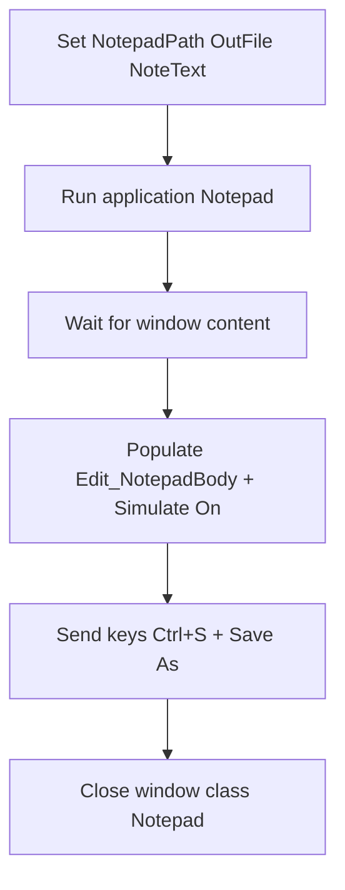

# Lab 01b — Notepad (ความรู้)

**หน้าปก:** [README.md](README.md) · **ลงมือทำ:** [LAB.md](LAB.md) · **พื้นฐานร่วม:** [`shared/PAD-FUNDAMENTALS.md`](../../shared/PAD-FUNDAMENTALS.md)

**วัน:** 1 · **ระดับ:** Beginner · **อ่านประมาณ:** 10–15 นาที

## 1. บทนี้เรียนอะไร / จบแล้วทำอะไรได้

เมื่อจบบทนี้ คุณจะ:

- อธิบายได้ว่าทำไมต้องใช้ **UI Elements** / selector แทนการคลิกด้วยพิกัดจอ (X,Y)
- เปิด รอ และปิด Notepad ด้วย **Run application**, **Wait for window content**, **Close window**
- Capture element ด้วย UI Picker (**Ctrl + Left Click**) แล้ว **Test** ใน Selector Builder
- กรอกข้อความด้วย **Populate text field in window** + **Simulate action** แล้ว Save As
- เข้าใจกฎ `%` ตอนสร้างชื่อตัวแปร vs ตอนอ้างอิงค่า

## 2. เรื่องราวจากงานจริง

หลายงานบนเครื่อง Windows ไม่ได้อยู่บนเว็บ — เช่น พิมพ์บันทึกใน Notepad แล้วเซฟไฟล์  
ถ้าคลิกตามพิกัดจอ เมื่อย้ายหน้าต่างหรือเปลี่ยนความละเอียด flow จะพัง งานของบทนี้คือฝึกจับ **UI Elements** บน Notepad ให้ Replay ได้ โดยไม่พึ่ง Lab Hub

## 3. ศัพท์ทีละคำ

| ศัพท์ | ความหมายภาษาคน | เห็นที่ไหนใน PAD |
|--------|----------------|------------------|
| **UI Element** | ตัวแทนของปุ่ม/ช่องบนหน้าต่างแอป | แผง **UI Elements** |
| **UI Picker** | เครื่องมือชี้ element บนจอ | Add element → **Ctrl + Left Click** |
| **Selector Builder** | หน้าต่างดู/ทดสอบ attribute ของ element | **Test** / Validate |
| **Run application** | สั่งเปิดโปรแกรมจาก path | Actions → System |
| **Focus window** | ดึงหน้าต่างมาอยู่ด้านหน้า | UI / Window actions |
| **Simulate action** | ใส่ข้อความทั้งก้อนแบบ programmatic | ใน **Populate text field in window** |
| **Populate text field in window** | พิมพ์ข้อความลงช่องของแอป Windows | ต่างจาก Populate บนเว็บ |
| **UIPI** | ข้อจำกัดสิทธิ์ที่อาจบล็อก UI automation | เอกสาร troubleshooting ของ Microsoft |

## 4. แนวคิดหลัก

แนวคิดสำคัญ: **Capture element ที่เสถียร → Wait → Interact → Close**  
แยกชัด Web UI (Lab 01) กับ Desktop UI (Lab นี้) — ชื่อ action คนละกลุ่ม



Pseudo-flow:

```text
NotepadPath = C:\Windows\System32\notepad.exe
OutFile = C:\PAD-Labs\output\lab01b\notepad-output.txt
NoteText = เนื้อหาจาก notepad-message.txt
Run Notepad → Wait → Populate %NoteText% (Simulate On) → Save As %OutFile% → Close by class Notepad
```

## 5. ตาราง Action ที่จะใช้

| Action (official) | ทำอะไร | Input สำคัญ | **Variables produced** (ชื่อตอนสร้าง — ไม่มี `%`) |
|-------------------|--------|-------------|--------------------------------------|
| **Set variable** | ตั้ง path / ข้อความ | Name, Value | — |
| **Run application** | เปิด Notepad | Application path | ตามที่ designer มี |
| **Wait for window content** | รอเนื้อหาหน้าต่าง | หน้าต่าง / element | — |
| **Focus window** | โฟกัสหน้าต่าง (ทางสำรอง) | หน้าต่างเป้าหมาย | — |
| **Populate text field in window** | พิมพ์ลงช่อง | UI element, Text, **Simulate action** | — |
| **Send keys** | ส่งคีย์ลัด เช่น Ctrl+S | Keys, หน้าต่าง | — |
| **Close window** | ปิดหน้าต่างแอป | title และ/หรือ class | — |

## 6. เปรียบเทียบตัวเลือกที่มักสับสน

| หัวข้อ | ตัวเลือก A | ตัวเลือก B | เลือกเมื่อไหร่ |
|--------|------------|------------|----------------|
| เป้าหมายคลิก | **UI Element** | พิกัด X,Y | ใช้ UI Element เป็นหลัก |
| กรอกข้อความ | **Populate text field in window** | **Populate text field on web page** | in window = แอป Windows; on web page = เว็บ |
| Simulate | **On** | Off (physical) | Lab นี้แนะนำ On — Off อาจพิมพ์ไม่ครบ |
| ปิด Notepad | class `Notepad` | title ตายตัว | title เปลี่ยนหลัง Save As — ใช้ class |
| ปิดแอป | **Close window** | **Terminate process** | Close ก่อน; Terminate เป็นทางสำรอง |

## 7. กฎ `%` และ Variables pane

- ช่อง **Name** / **Variables produced** → พิมพ์ `NoteText`, `OutFile` (**ไม่มี `%`**)
- ช่อง Application path / Text to fill-in → `%NotepadPath%`, `%NoteText%`, `%OutFile%` (**มี `%`**)
- รายละเอียดเต็ม: [`shared/PAD-FUNDAMENTALS.md`](../../shared/PAD-FUNDAMENTALS.md)

## 8. จุดที่มือใหม่พลาดบ่อย

| อาการ | สาเหตุที่พบบ่อย | วิธีสังเกต |
|-------|-----------------|------------|
| พิมพ์ไม่เข้า Notepad | ยังไม่ Wait หรือหน้าต่างอยู่ด้านหลัง | มี **Wait for window content**; ถ้ายังไม่เข้าค่อยเพิ่ม **Focus window** |
| ข้อความไม่ครบ / ขาดตัว | **Simulate action** ยัง Off | ใน Populate เปิด **Simulate action** |
| Save As ไม่ครบ | ลืม capture ช่อง path / ปุ่ม Yes | dialog ค้างตอนรัน |
| Close ไม่เจอหลัง Save As | ล็อก title เดิม | ใช้ Window class `Notepad` |
| Replay เปิดแอปซ้อน | ไม่ Close ก่อนรอบใหม่ | มีหลาย Notepad |

## 9. คำถามทบทวน

**1.** ทำไมไม่ควรคลิกด้วยพิกัดจอเป็นหลัก?

<details>
<summary>เฉลย</summary>
เมื่อย้ายหน้าต่าง เปลี่ยนความละเอียด หรือ DPI ตำแหน่ง X,Y จะเพี้ยน — ใช้ <strong>UI Elements</strong> ที่ผูกกับ control จริงจะเสถียรกว่า
</details>

**2.** ใน UI Picker ใช้ปุ่มลัดอะไรจับ element?

<details>
<summary>เฉลย</summary>
<strong>Ctrl + Left Click</strong> แล้วตั้งชื่อสื่อความหมาย เช่น <code>Edit_NotepadBody</code>
</details>

**3.** Populate ของ Lab นี้ต่างจาก Lab 01 อย่างไร?

<details>
<summary>เฉลย</summary>
Lab นี้ใช้ <strong>Populate text field in window</strong> (แอป Windows) ส่วน Lab 01 ใช้ <strong>Populate text field on web page</strong>
</details>

**4.** ทำไมแนะนำเปิด Simulate action?

<details>
<summary>เฉลย</summary>
โหมด Off ส่งคีย์จริงทีละตัว อาจขาดตัวอักษร — On ใส่ข้อความทั้งก้อนแบบ programmatic จึงครบกว่า
</details>

**5.** ช่อง Name ของ Set variable ใส่ `%NoteText%` ได้หรือไม่?

<details>
<summary>เฉลย</summary>
ไม่ได้ — ตอนสร้างชื่อพิมพ์ <code>NoteText</code> ไม่มี <code>%</code>; ตอนอ้างอิงใน Text to fill-in ใช้ <code>%NoteText%</code>
</details>

## 10. อ้างอิง (Aug 2026)

| แหล่ง | URL |
|-------|-----|
| UI automation actions | https://learn.microsoft.com/power-automate/desktop-flows/actions-reference/uiautomation |
| System actions | https://learn.microsoft.com/power-automate/desktop-flows/actions-reference/system |
| UIPI troubleshooting | https://learn.microsoft.com/troubleshoot/power-platform/power-automate/desktop-flows/ui-automation/uipi-issues |
| รายการแหล่งใน Lab Kit | [PAD version matrix](https://learn.microsoft.com/power-platform/released-versions/power-automate-desktop) |

---

**ถัดไป:** เปิด [LAB.md](LAB.md) แล้วทำ Hands-on ทีละขั้น · ถ้าเหลือเวลา: [Lab 01b Calculator](../01b-calculator/README.md)
