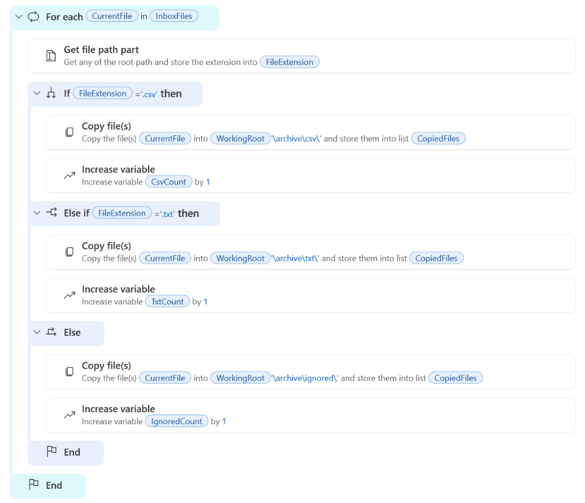

# Lab 02 — File Management (Hands-on)

**อ่านก่อน:** [LESSON.md](LESSON.md) · **หน้าปกบท:** [README.md](README.md) · **พื้นฐาน:** [`shared/PAD-FUNDAMENTALS.md`](../../shared/PAD-FUNDAMENTALS.md)

**วัน:** 1 · **ระดับ:** Beginner  
**ทักษะ:** Folder/File actions, Get files, Copy/Move, Get file path part, Read/Write text

> **Catch-up:** ตามไม่ทัน → วาง [`scripts/02-file-management.robin`](scripts/02-file-management.robin) ใน flow ว่าง (full — ไม่ต้อง rebind UI)

## อ้างอิง (Aug 2026)

| แหล่ง | URL |
|-------|-----|
| Official tutorial (pattern เดียวกับ Lab นี้) | [Getting started — free org](https://learn.microsoft.com/power-automate/desktop-flows/getting-started-freeorg) |
| Folder actions | [actions-reference/folder](https://learn.microsoft.com/power-automate/desktop-flows/actions-reference/folder) |
| File actions | [actions-reference/file](https://learn.microsoft.com/power-automate/desktop-flows/actions-reference/file) |

## Setup บนเครื่อง (ทำก่อนเปิด designer)

1. สร้างโฟลเดอร์ working และ output (คัดลอกได้):

```text
C:\PAD-Labs\working\lab02\
```

```text
C:\PAD-Labs\output\lab02\
```

2. คัดลอกทั้งโฟลเดอร์ [`assets/inbox`](assets/inbox/) ไปยัง:

```text
C:\PAD-Labs\working\lab02\inbox
```

3. สร้างโฟลเดอร์ว่าง (ถ้ายังไม่มี):

```text
C:\PAD-Labs\working\lab02\archive
```

4. ตรวจว่าใน `inbox` มีไฟล์อย่างน้อย: `order-1001.csv`, `order-1002.csv`, `readme-note.txt`, `invoice-demo.txt`, `skip-me.tmp`

> ถ้าใช้ไดรฟ์อื่น (เช่น `D:\PAD-Labs\...`) ได้ — แต่ต้องใช้ path นั้นใน `%WorkingRoot%` ให้สม่ำเสมอทั้ง flow

## Input / Output

| | Path |
|--|------|
| Mock inbox | [`assets/inbox/`](assets/inbox/) |
| Expected mapping | [`assets/expected/expected-manifest.csv`](assets/expected/expected-manifest.csv) |
| Output summary | ดู code block ใน Step 5 |

| ไฟล์ใน inbox | การจัดการ |
|--------------|-----------|
| `order-1001.csv`, `order-1002.csv` | Copy → `archive\csv\` |
| `readme-note.txt`, `invoice-demo.txt` | Copy → `archive\txt\` |
| `skip-me.tmp` | Copy/Move → `archive\ignored\` (หรือข้าม แต่ต้องนับเป็น IGNORED) |

---

## Hands-on ทีละขั้น

### Step 0 — สร้าง flow

1. เปิด Power Automate for desktop → **New flow**
2. ชื่อ flow (คัดลอกได้):

```text
Lab02_FileManagement
```

3. กด **Create**

> **กฎตัวแปรใน PAD (อ่านก่อนทำ Step ถัดไป)**  
> - ช่อง **Name** ของ **Set variable**, ส่วน **Variables produced**, และ **Store into** = พิมพ์ชื่ออย่างเดียว **ไม่มี `%`** เช่น `WorkingRoot`  
> - ช่องอื่นที่ต้องดึงค่าตัวแปร (Folder, File path, Text, …) = ใช้ `%WorkingRoot%` (**มี `%` ครบสองด้าน**)  
> - หลังสร้างแล้ว Variables pane อาจแสดงเป็น `%WorkingRoot%` — เป็นเรื่องปกติ

### Step 1 — ตั้ง path และตัวนับ

1. ลาก **Set variable** ลง workspace
2. ตั้งค่า:
   - Name: `WorkingRoot` ← **ไม่ใส่ `%`**
   - Value: (คัดลอกด้านล่างวางในช่อง Value — หรือ path ที่คุณใช้จริง)

```text
C:\PAD-Labs\working\lab02
```

3. เพิ่ม **Set variable** อีก 3 ตัว (Name ไม่มี `%`):
   - Name: `CsvCount` ← Value:

```text
0
```

   - Name: `TxtCount` ← Value:

```text
0
```

   - Name: `IgnoredCount` ← Value:

```text
0
```

> Tip (2606+): ถ้า Variables pane รองรับ **Default value** ตั้งค่าเริ่มต้นที่นั่นได้ — แต่ใน Lab นี้ใช้ Set variable ก็ผ่านเกณฑ์

### Step 2 — สร้างโฟลเดอร์ปลายทาง (csv / txt / ignored)

ทำซ้ำ 3 ชุด (csv / txt / ignored) — อย่า hardcode คนละไดรฟ์กับ `%WorkingRoot%`

> **ตั้งค่า If folder:** เลือก **Doesn't exist** (ไม่ใช้ค่าเริ่มต้น Exists)  
> แปลว่า “ถ้าโฟลเดอร์**ยังไม่มี** → ทำในกิ่ง Then” — วาง **Create folder** ใน Then ได้เลย **ไม่ต้องใช้ Else**

ขั้นตอนต่อหนึ่งชุด:

1. ลาก **If folder exists**  
2. ตั้ง **If folder** = **Doesn't exist**  
3. ช่อง Folder path วาง path จากตารางด้านล่าง  
4. **ในกิ่ง Then** ลาก **Create folder** → ชื่อโฟลเดอร์ + Into จากตาราง  
5. ปิดด้วย **End** (ไม่ต้องเพิ่ม Else)

| ชุด | Folder path | ชื่อโฟลเดอร์ (`Create folder` ใน **Then**) | Into |
|-----|-------------|---------------------------------------------|------|
| csv | `%WorkingRoot%\archive\csv` | `csv` | `%WorkingRoot%\archive` |
| txt | `%WorkingRoot%\archive\txt` | `txt` | `%WorkingRoot%\archive` |
| ignored | `%WorkingRoot%\archive\ignored` | `ignored` | `%WorkingRoot%\archive` |

คัดลอกทีละช่อง:

**csv — Folder path**

```text
%WorkingRoot%\archive\csv
```

**csv — ชื่อโฟลเดอร์ (Then → Create folder)**

```text
csv
```

**csv — Into (Then → Create folder)**

```text
%WorkingRoot%\archive
```

**txt — Folder path**

```text
%WorkingRoot%\archive\txt
```

**txt — ชื่อโฟลเดอร์ (Then)**

```text
txt
```

**txt — Into (Then)**

```text
%WorkingRoot%\archive
```

**ignored — Folder path**

```text
%WorkingRoot%\archive\ignored
```

**ignored — ชื่อโฟลเดอร์ (Then)**

```text
ignored
```

**ignored — Into (Then)**

```text
%WorkingRoot%\archive
```

โครงที่ได้ควรคล้าย:

```text
If folder doesn't exist %WorkingRoot%\archive\csv
  Create folder csv into %WorkingRoot%\archive
End
(… txt …)
(… ignored …)
```

### Step 3 — ดึงรายการไฟล์จาก inbox

1. ลาก **Get files in folder**
2. ตั้งค่า:
   - Folder: (คัดลอก — **ใช้** ตัวแปร มี `%` และต่อ `\inbox`)

```text
%WorkingRoot%\inbox
```

   - File filter:

```text
*
```

   - Include subfolders: ปิด
3. **Variables produced:** `InboxFiles` ← **ไม่ใส่ `%`**  
   (เวลาอ้างอิงทีหลังใช้ `%InboxFiles%`)

อ้างอิงทางการ: action นี้คืน **List of files** แล้วนำไปวนด้วย **For each** — ตาม [Getting started](https://learn.microsoft.com/power-automate/desktop-flows/getting-started-freeorg)

### Step 4 — วนทีละไฟล์ + อ่านนามสกุล + แยก Copy

เป้าหมายของ Step นี้: ทำบล็อกใน workspace ให้**หน้าตาเหมือนภาพอ้างอิง**ด้านล่าง (ลำดับและย่อหน้าต้องตรง)



> **ก่อนเริ่ม:** action ทั้งหมดใน Step นี้ต้องอยู่ **ภายใน For each** (เยื้องเข้าไป) — อย่าวางข้างนอกลูป

#### 4.1 สร้างลูป For each

1. ลาก **For each** ลง workspace (หลัง **Get files in folder**)
2. เปิด action แล้วตั้งค่า:
   - **Value to iterate:** (คัดลอก)

```text
%InboxFiles%
```

   - **Store into:** `CurrentFile` ← **ไม่ใส่ `%`**

บนจอควรเห็นบรรทัดคล้าย: `For each CurrentFile in InboxFiles`

#### 4.2 ภายในลูป — อ่านนามสกุล

1. ลาก **Get file path part** ไปวาง **ระหว่าง** บรรทัด For each กับ End ของลูป (เยื้องเข้า)
2. ตั้งค่า:
   - **File path:** (คัดลอก — ไฟล์ปัจจุบันเท่านั้น **ห้าม** `%InboxFiles%`)

```text
%CurrentFile%
```

   - เลือกให้ได้ **Extension** (นามสกุล)
3. ในส่วน **Variables produced** ตั้งชื่อ: `FileExtension` ← **ไม่ใส่ `%`**

บนจอควรเห็นคล้าย: เก็บ extension ลง `FileExtension`

#### 4.3 ภายในลูป — สร้าง If / Else if / Else

ยังอยู่ **ภายใน For each** และวาง **หลัง** Get file path part:

1. ลาก **If** ลงในลูป
2. ตั้งเงื่อนไข If:
   - ฝั่งซ้าย:

```text
%FileExtension%
```

   - ตัวดำเนินการ: **Equal to**
   - ฝั่งขวา: (ถ้าใน Variables pane เห็นค่าไม่มีจุด ให้ใช้ `csv` แทน)

```text
.csv
```

3. คลิกแถบ/เมนูของบล็อก If เพื่อเพิ่ม **Else if** แล้วตั้งเงื่อนไข:
   - ฝั่งซ้าย: `%FileExtension%` · Equal to · ฝั่งขวา:

```text
.txt
```

4. เพิ่ม **Else** (กิ่งสุดท้าย — ไม่มีเงื่อนไข)

โครงบนจอต้องเป็น 3 กิ่ง: **If** → **Else if** → **Else** แล้วตามด้วย **End** ของ If

#### 4.4 กิ่ง If (`.csv`) — Copy + นับ

วาง **ภายในกิ่ง If** เท่านั้น (เยื้องเข้าใต้ `If FileExtension = '.csv'`):

1. ลาก **Copy file(s)**
2. ตั้งค่า:
   - **File(s) to copy:**

```text
%CurrentFile%
```

   - **Destination folder:**

```text
%WorkingRoot%\archive\csv
```

   - **If file exists:** Overwrite
3. **Variables produced** (ถ้ามี): `CopiedFiles` ← ไม่บังคับใช้ต่อ
4. ลาก **Increase variable** → เลือก `CsvCount` → เพิ่มทีละ `1`

#### 4.5 กิ่ง Else if (`.txt`) — Copy + นับ

วาง **ภายในกิ่ง Else if** เท่านั้น:

1. **Copy file(s)**
   - File(s):

```text
%CurrentFile%
```

   - Destination:

```text
%WorkingRoot%\archive\txt
```

   - If file exists: Overwrite
2. **Increase variable** → `TxtCount` + `1`

#### 4.6 กิ่ง Else (อื่น ๆ เช่น `.tmp`) — Copy + นับ

วาง **ภายในกิ่ง Else** เท่านั้น:

1. **Copy file(s)**
   - File(s):

```text
%CurrentFile%
```

   - Destination:

```text
%WorkingRoot%\archive\ignored
```

   - If file exists: Overwrite
2. **Increase variable** → `IgnoredCount` + `1`

#### 4.7 ตรวจก่อนไป Step ถัดไป

เทียบกับภาพอ้างอิง — ต้องครบทุกข้อ:

- [ ] มี **For each** … **End** ครอบทั้งชุด
- [ ] ในลูปมี **Get file path part** ก่อน If
- [ ] มี **If** / **Else if** / **Else** / **End**
- [ ] แต่ละกิ่งมี **Copy file(s)** ใช้ `%CurrentFile%` (ไม่ใช่ `%InboxFiles%`)
- [ ] แต่ละกิ่งมี **Increase variable** คนละตัวนับ (`CsvCount` / `TxtCount` / `IgnoredCount`)
- [ ] ปลายทางเป็น `archive\csv` · `archive\txt` · `archive\ignored` ตามกิ่ง (ตาม reference — ไม่บังคับ trailing `\`)

โครงย่อ (เทียบจอ / [`02-file-management.robin`](scripts/02-file-management.robin)):

```text
For each CurrentFile in InboxFiles
  Get file path part → FileExtension
  If FileExtension = '.csv'
    Copy CurrentFile → %WorkingRoot%\archive\csv
    Increase CsvCount
  Else if FileExtension = '.txt'
    Copy CurrentFile → %WorkingRoot%\archive\txt
    Increase TxtCount
  Else
    Copy CurrentFile → %WorkingRoot%\archive\ignored
    Increase IgnoredCount
  End
End
```

### Step 5 — เขียน summary.txt

1. **หลัง** End ของ For each ลาก **Set variable**
2. Name: `SummaryText` ← **ไม่ใส่ `%`**
3. Value: (คัดลอกทั้งบรรทัด — ตาม reference script รวมช่องว่างรอบ `;`)

```text
CSV=%CsvCount% ; TXT=%TxtCount% ; IGNORED=%IgnoredCount% ;  Done
```

4. ลาก **Write text to file**
5. ตั้งค่า:
   - File path: (คัดลอก)

```text
%WorkingRoot%\summary.txt
```

   - Text to write: (คัดลอก)

```text
%SummaryText%
```

   - If file exists: Overwrite
   - Encoding: Unicode (ตาม reference)
   - Append new line: On (ตาม reference)
6. (ทางเลือก) สร้างโฟลเดอร์ `output\lab02` ด้วย **If folder exists** (**Doesn't exist**) + **Create folder** ใน Then ก่อนเขียนไฟล์ — reference เขียนใต้ `WorkingRoot` โดยตรง

### Step 6 — รันและตรวจ

1. กด **Run**
2. เปิดโฟลเดอร์ `archive\csv`, `archive\txt`, `archive\ignored` เทียบตารางด้านบน
3. เปิด `summary.txt` ต้องได้แนว (ช่องว่างตาม reference):

```text
CSV=2 ; TXT=2 ; IGNORED=1 ;  Done
```

4. รันซ้ำรอบสอง — ต้องไม่พัง (มี overwrite / If exists ชัด)

### Challenge (ทางเลือก)

หลัง Copy สำเร็จ ใช้ **Delete file** ลบไฟล์ต้นทางใน `inbox` — ทำเฉพาะ working copy ห้ามลบใน repo `assets/`

---

## จุดที่มักทำผิด

| ผิด | ถูก |
|-----|-----|
| พิมพ์ `%WorkingRoot%` ในช่อง **Name** ของ Set variable | Name = `WorkingRoot` (ไม่มี `%`) |
| **Copy file(s)** ใส่ `%InboxFiles%` ในลูป | ใส่ `%CurrentFile%` (ใช้ตัวแปรไฟล์ปัจจุบัน) |
| **Get files in folder** จาก `%WorkingRoot%` | จาก `%WorkingRoot%\inbox` |
| Hardcode `D:\...` ปนกับ `%WorkingRoot%` คนละราก | ใช้ `%WorkingRoot%` ทั้ง flow ตอนอ้างอิง path |
| ลืมตั้ง **Doesn't exist** แล้ววาง Create ใน Then | ตั้ง **If folder** = **Doesn't exist** แล้ว Create ใน Then |
| มีแค่สาขา `.csv` | ต้องมี `.txt` และ Else (ignored) |
| ไม่เขียน `summary.txt` | Step 5 บังคับตามเกณฑ์ผ่าน |
| Copy / Increase อยู่นอกลูปหรือนอกกิ่ง If | ต้องเยื้องเข้าใน For each และในกิ่งที่ถูกต้อง — เทียบภาพอ้างอิง |

---

## Variables

| ชื่อตอนสร้าง (ไม่มี `%`) | ตอนอ้างอิง | Type |
|--------------------------|------------|------|
| `WorkingRoot` | `%WorkingRoot%` | Text |
| `InboxFiles` | `%InboxFiles%` | File list |
| `CurrentFile` | `%CurrentFile%` | File |
| `FileExtension` | `%FileExtension%` | Text |
| `CsvCount` / `TxtCount` / `IgnoredCount` | `%CsvCount%` ฯลฯ | Numeric |
| `SummaryText` | `%SummaryText%` | Text |

## Expected Result

- `archive\csv\` มี CSV สองไฟล์, `archive\txt\` มี TXT สองไฟล์
- `skip-me.tmp` ไม่อยู่ใน csv/txt
- `summary.txt` ตัวเลขตรง expected manifest

## Acceptance Criteria

- [ ] สร้างโฟลเดอร์ด้วย Flow (ไม่สร้างมือทั้งหมด)
- [ ] คัดลอกตามนามสกุลถูกต้อง และ Copy เป็นทีละไฟล์ใน For each
- [ ] มีไฟล์สรุปผล
- [ ] รันซ้ำได้โดยไม่พัง (If exists / overwrite ชัด)

## Troubleshooting

| อาการ | แก้ |
|-------|-----|
| File in use | ปิดโปรแกรมที่เปิดไฟล์อยู่ |
| Path not found | ตรวจ `%WorkingRoot%` และ Create folder ก่อน; ตรวจว่ามีโฟลเดอร์ `inbox` |
| นับไฟล์ไม่ตรง | กรองเฉพาะไฟล์ ไม่รวม subfolder; ตรวจ extension มีจุดหรือไม่ |
| Copy ทั้งชุดซ้ำ | ตรวจว่าไม่ได้ใส่ `%InboxFiles%` ใน Copy |

## Cleanup

- ลบ `C:\PAD-Labs\working\lab02` ได้หลังผ่านเกณฑ์
- คงต้นฉบับใน repo `assets/` ไว้เสมอ
