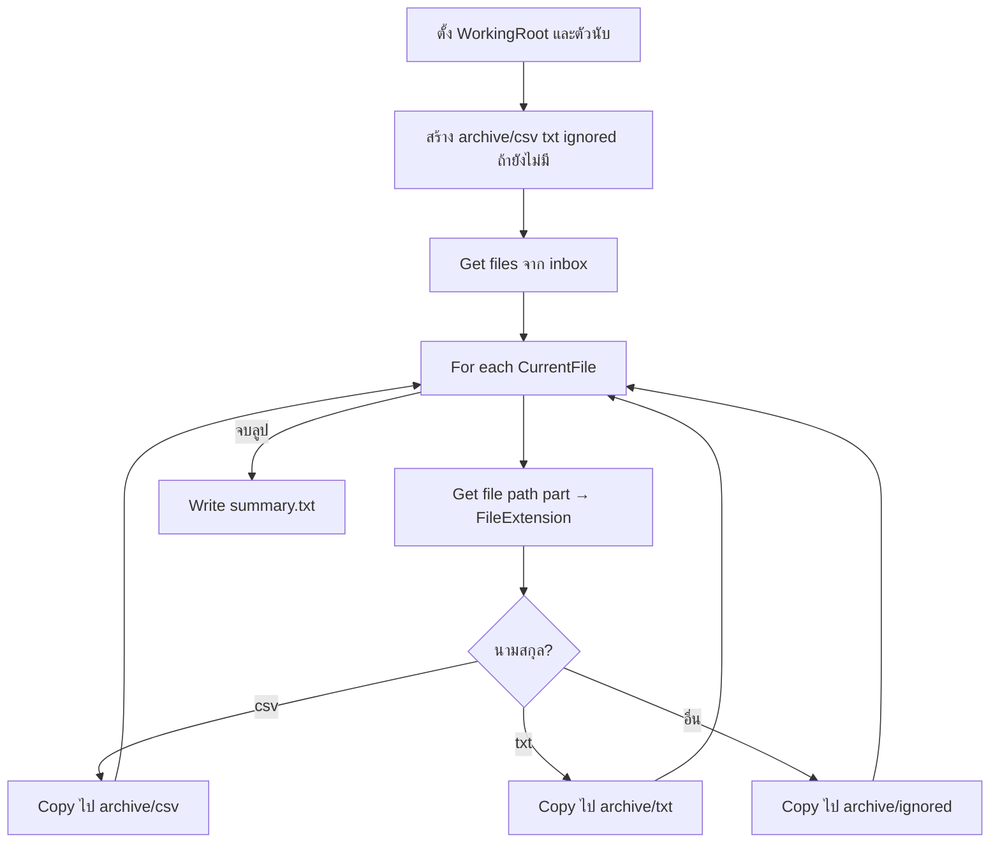

# Lab 02 — File Management (ความรู้)

**หน้าปก:** [README.md](README.md) · **ลงมือทำ:** [LAB.md](LAB.md) · **พื้นฐานร่วม:** [`shared/PAD-FUNDAMENTALS.md`](../../shared/PAD-FUNDAMENTALS.md)

**วัน:** 1 · **ระดับ:** Beginner · **อ่านประมาณ:** 15–25 นาที

## 1. บทนี้เรียนอะไร / จบแล้วทำอะไรได้

เมื่อจบบทนี้ คุณจะ:

- อธิบายได้ว่าทำไมต้องสร้างโฟลเดอร์ด้วย flow (ไม่พึ่งสร้างมืออย่างเดียว)
- แยกได้ระหว่าง **รายการไฟล์ทั้งชุด** กับ **ไฟล์ทีละไฟล์ในลูป**
- ใช้ **Get files in folder** → **For each** → **Get file path part** → **Copy file(s)** ตามนามสกุล
- เขียนไฟล์สรุปด้วย **Write text to file**
- เข้าใจกฎ `%` ตอนสร้างชื่อตัวแปร vs ตอนอ้างอิงค่า

## 2. เรื่องราวจากงานจริง

สมมติคุณอยู่ทีม operations: ทุกเช้ามีไฟล์หล่นลงโฟลเดอร์ **inbox** ปนกันทั้งใบสั่งซื้อ (`.csv`) บันทึกข้อความ (`.txt`) และไฟล์ชั่วคราวที่ไม่ต้องประมวลผล (`.tmp`)  
ถ้าจัดมือทุกวัน จะเสียเวลาและพลาดได้ง่าย งานของบทนี้คือสร้าง **desktop flow** ที่จัดไฟล์เข้าโฟลเดอร์ `archive\csv`, `archive\txt`, `archive\ignored` แล้วเขียน `summary.txt` ว่าวันนี้มีกี่ไฟล์แต่ละประเภท

## 3. ศัพท์ทีละคำ

| ศัพท์ | ความหมายภาษาคน | เห็นที่ไหนใน PAD |
|--------|----------------|------------------|
| **Folder** | โฟลเดอร์ / ไดเรกทอรี | ช่อง Folder ของ Get files / Create folder |
| **File filter** | ตัวกรองชื่อไฟล์ เช่น `*` = ทุกไฟล์, `*.csv` = เฉพาะ CSV | Get files in folder |
| **File list** | รายชื่อไฟล์หลายไฟล์ในตัวแปรเดียว | **Variables produced** ของ Get files เช่น `InboxFiles` |
| **For each** | วนทำซ้ำ “ทีละชิ้น” จากรายการ | Actions → Loops |
| **Extension** | นามสกุลไฟล์ เช่น `.csv`, `.txt` | Get file path part |
| **Copy vs Move** | Copy = สำเนาไปปลายทาง / Move = ย้ายออกจากต้นทาง | Copy file(s) / Move file(s) |
| **Overwrite** | ถ้าปลายทางมีไฟล์ชื่อซ้ำ ให้เขียนทับ | ตัวเลือกใน Copy / Write text |

## 4. แนวคิดหลัก

แนวคิดสำคัญ: **ดึงรายการก่อน แล้วค่อยวนทีละไฟล์** — อย่า Copy ทั้งลิสต์ภายในลูป



Pseudo-flow:

```text
WorkingRoot = C:\PAD-Labs\working\lab02
สร้างโฟลเดอร์ archive\csv, txt, ignored (ถ้ายังไม่มี)
InboxFiles = ไฟล์ทั้งหมดใน WorkingRoot\inbox
สำหรับแต่ละ CurrentFile ใน InboxFiles:
  อ่าน FileExtension
  ถ้า .csv → Copy CurrentFile ไป archive\csv แล้ว CsvCount++
  ไม่งั้นถ้า .txt → Copy ไป archive\txt แล้ว TxtCount++
  ไม่งั้น → Copy ไป archive\ignored แล้ว IgnoredCount++
เขียน summary: CSV=…; TXT=…; IGNORED=…; Done
```

## 5. ตาราง Action ที่จะใช้

| Action (official) | ทำอะไร | Input สำคัญ | **Variables produced** (ชื่อตอนสร้าง — ไม่มี `%`) |
|-------------------|--------|-------------|--------------------------------------|
| **Set variable** | ตั้งค่าตัวแปร | Name, Value | — (ใช้ชื่อที่คุณตั้ง) |
| **If folder exists** | ตรวจว่ามี/ไม่มีโฟลเดอร์ แล้วแยกกิ่ง | Folder path · **If folder** = Exists หรือ Doesn't exist | — |
| **Create folder** | สร้างโฟลเดอร์ย่อย | Folder name, Into path | `NewFolder` (มักไม่ใช้ต่อ) |
| **Get files in folder** | ดึงรายการไฟล์ | Folder, File filter | `InboxFiles` |
| **For each** | วนทีละรายการ | Value to iterate, Store into | Store into = `CurrentFile` |
| **Get file path part** | แยก path / ชื่อ / นามสกุล | File path | `FileExtension` |
| **If / Else if / Else** | แยกทางตามเงื่อนไข | เงื่อนไขเปรียบเทียบ | — |
| **Copy file(s)** | คัดลอกไฟล์ | File(s), Destination | `CopiedFiles` (ทางเลือก) |
| **Increase variable** | บวกตัวนับ | ตัวแปรตัวเลข | — |
| **Write text to file** | เขียนไฟล์ข้อความ | File path, Text | — |

## 6. เปรียบเทียบตัวเลือกที่มักสับสน

| หัวข้อ | ตัวเลือก A | ตัวเลือก B | เลือกเมื่อไหร่ |
|--------|------------|------------|----------------|
| การจัดการไฟล์ | **Copy file(s)** | **Move file(s)** | Copy เมื่ออยากเก็บต้นทาง; Move เมื่ออยากย้ายออกจาก inbox |
| เป้าหมายในลูป | `%CurrentFile%` | `%InboxFiles%` | **ต้องใช้ CurrentFile** — InboxFiles คือทั้งลิสต์ |
| แหล่ง Get files | `%WorkingRoot%\inbox` | `%WorkingRoot%` | ต้องชี้ **inbox** ไม่ใช่ราก working |
| สร้างโฟลเดอร์ถ้ายังไม่มี | **If folder** = **Doesn't exist** → Create ใน Then | **Exists** → Create ใน Else | Lab นี้ใช้ **Doesn't exist** — อ่านตรงเจตนา ไม่ต้องมี Else ว่าง |
| นามสกุล | `.csv` (มีจุด) | `csv` (ไม่มีจุด) | ดูค่าจริงใน Variables pane แล้วเทียบให้ตรง |

## 7. กฎ `%` และ Variables pane

- ช่อง **Name** / **Store into** / **Variables produced** → พิมพ์ `WorkingRoot`, `CurrentFile`, `InboxFiles` (**ไม่มี `%`**)
- ช่อง Folder / path / ข้อความที่ต้องการดึงค่า → `%WorkingRoot%\inbox`, `%CurrentFile%` (**มี `%`**)
- รายละเอียดเต็ม: [`shared/PAD-FUNDAMENTALS.md`](../../shared/PAD-FUNDAMENTALS.md)

## 8. จุดที่มือใหม่พลาดบ่อย

| อาการ | สาเหตุที่พบบ่อย | วิธีสังเกต |
|-------|-----------------|------------|
| Copy ซ้ำทั้งชุดทุกครั้งที่เจอ `.csv` | ใส่ `%InboxFiles%` ใน Copy แทน `%CurrentFile%` | ดูจำนวนไฟล์ในปลายทางพุ่งผิดปกติ |
| Path not found | ยังไม่มี `inbox` หรือ `%WorkingRoot%` คนละไดรฟ์ | Run next action แล้วดูค่า WorkingRoot |
| นับไฟล์ไม่ตรง | นามสกุลมี/ไม่มีจุดไม่ตรงเงื่อนไข If | ดู `%FileExtension%` ใน Variables pane |
| สร้างโฟลเดอร์ไม่สำเร็จ | Create folder ชี้ Into path ผิด หรือลืมตั้ง **Doesn't exist** | ตรวจ Into = `%WorkingRoot%\archive` และ Create อยู่ในกิ่ง Then |

## 9. คำถามทบทวน

**1.** ตอน **Set variable** ช่อง Name ควรพิมพ์แบบไหน?

<details>
<summary>เฉลย</summary>
พิมพ์ชื่อเปล่า เช่น <code>WorkingRoot</code> — <strong>ไม่ใส่</strong> <code>%</code>
</details>

**2.** ใน **For each** ทำไมต้อง Copy `%CurrentFile%` ไม่ใช่ `%InboxFiles%`?

<details>
<summary>เฉลย</summary>
<code>InboxFiles</code> คือรายการทั้งชุด — ถ้า Copy ทั้งลิสต์ทุกครั้งที่เข้าเงื่อนไข จะสำเนาไฟล์ซ้ำและผิดเจตนา “ทีละไฟล์”
</details>

**3.** **Get files in folder** ควรชี้ไป path ใดใน Lab นี้?

<details>
<summary>เฉลย</summary>
<code>%WorkingRoot%\inbox</code> ไม่ใช่แค่ <code>%WorkingRoot%</code>
</details>

**4.** Copy กับ Move ต่างกันอย่างไรในบริบท inbox?

<details>
<summary>เฉลย</summary>
Copy คงไฟล์ต้นทางไว้ใน inbox; Move ย้ายออกจาก inbox ไปปลายทาง — Lab หลักใช้ Copy (Challenge อาจ Delete หลัง Copy)
</details>

**5.** ข้อความใน `summary.txt` ใช้ `%CsvCount%` ในช่อง Value ได้เพราะอะไร?

<details>
<summary>เฉลย</summary>
เพราะตอนนั้นเป็นการ <strong>อ้างอิงค่า</strong> ตัวแปรในข้อความ — ต้องมี <code>%</code> ครบสองด้าน (ต่างจากช่อง Name ที่ห้ามใส่)
</details>

## 10. อ้างอิง (Aug 2026)

| แหล่ง | URL |
|-------|-----|
| Getting started (file backup pattern) | https://learn.microsoft.com/power-automate/desktop-flows/getting-started-freeorg |
| Folder actions | https://learn.microsoft.com/power-automate/desktop-flows/actions-reference/folder |
| File actions | https://learn.microsoft.com/power-automate/desktop-flows/actions-reference/file |
| รายการแหล่งใน Lab Kit | [PAD version matrix](https://learn.microsoft.com/power-platform/released-versions/power-automate-desktop) |

---

**ถัดไป:** เปิด [LAB.md](LAB.md) แล้วทำ Hands-on ทีละขั้น
