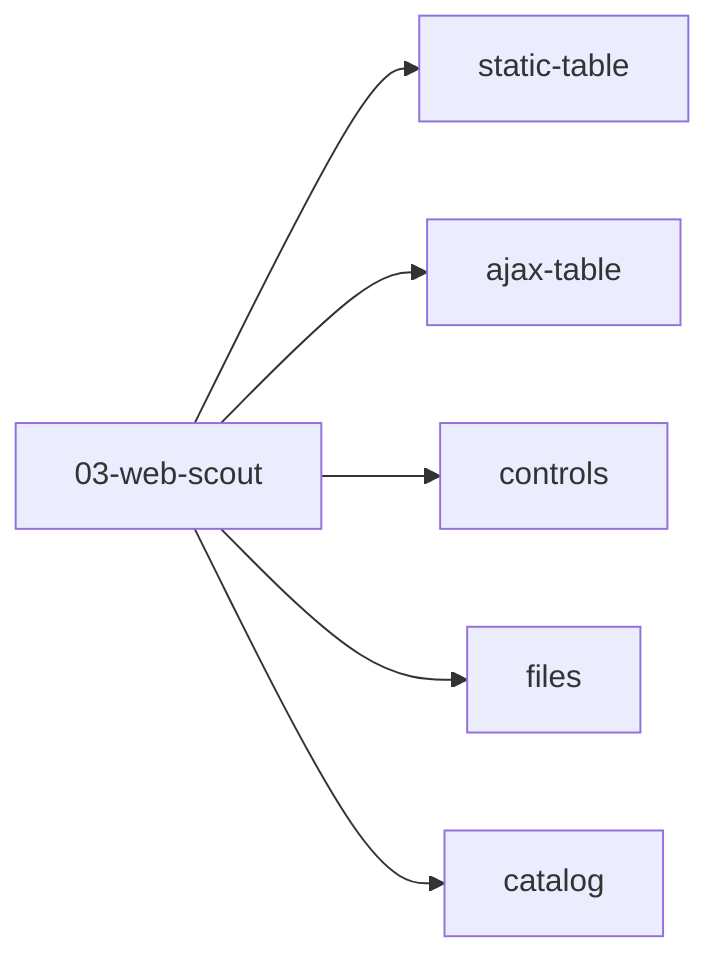

# Lab 03 — Web Scout (แผนที่บท)

**วัน:** 1 · **ระดับ:** Intermediate  
**บทบาท:** Index — lab ย่อยอยู่**ในโฟลเดอร์นี้** (flow แยก) ไม่ใช่ Mission รวมใน flow เดียว

เลิกโครง Mission A–D/P + `%ScoutResults%` / `SourcePage` ร่วมแล้ว — แต่ละ lab มี flow และ CSV ของตัวเองใต้ `C:\PAD-Labs\output\lab03\`

## ลำดับเรียนที่แนะนำ

| ลำดับ | Lab | Flow | สถานะ | หน้า Hub |
|------|-----|------|--------|----------|
| 1 | [Static Table](static-table/README.md) | `Lab03_StaticTable` | **Core** | [03-table](https://pad.ontoiq.tech/pad/03-table.html) · `#tbl-employees` |
| 2 | [AJAX Table](ajax-table/README.md) | `Lab03_AjaxTable` | **Core** | [09-ajax-table](https://pad.ontoiq.tech/pad/09-ajax-table.html) · `#tbl-orders` |
| 3 | [Catalog](catalog/README.md) | `Lab03_Catalog` | Optional (pagination) | [19-catalog](https://pad.ontoiq.tech/pad/19-catalog.html) · Next loop |
| 4 | [Controls](controls/README.md) | `Lab03_Controls` | Optional | [02-controls](https://pad.ontoiq.tech/pad/02-controls.html) |
| 5 | [Files](files/README.md) | `Lab03_Files` | Optional | [05-files](https://pad.ontoiq.tech/pad/05-files.html) |



## แยกประเภทตาราง (อย่าสับสน)

| หน้า | ลักษณะ | Lab |
|------|--------|-----|
| 03-table | Static หน้าเดียว — **ไม่มี** Prev/Next | [Static Table](static-table/README.md) |
| 09-ajax-table | แถวโผล่หลังโหลด — Wait ก่อน Extract | [AJAX Table](ajax-table/README.md) |
| 19-catalog | มี **Next** หลายหน้า | [Catalog](catalog/README.md) |

## ในห้อง (Core)

ทำ **Static + AJAX** ตาม [`shared/CLASSROOM-SCHEDULE-12H.md`](../../shared/CLASSROOM-SCHEDULE-12H.md)  
Catalog / Controls / Files = บ้านหรือถ้าเวลาเหลือ

## โบนัส (ไม่แยกโฟลเดอร์รอบนี้)

- Iframe: [08-iframe](https://pad.ontoiq.tech/pad/08-iframe.html) (ดู hub)
- API mock: [12-api](https://pad.ontoiq.tech/pad/12-api.html) (ดู hub)

## Prerequisites

- PAD + browser extension (แนะนำ **2607+**)
- อ่าน [`shared/SELECTOR-CONVENTIONS.md`](../../shared/SELECTOR-CONVENTIONS.md)
- พื้นฐาน: [`shared/PAD-FUNDAMENTALS.md`](../../shared/PAD-FUNDAMENTALS.md)

## Output รวม

```text
C:\PAD-Labs\output\lab03\
  static-table.csv
  ajax-orders.csv
  catalog-products.csv      (optional)
  controls-result.csv       (optional)
  …
C:\PAD-Labs\downloads\      (Files lab)
```

## โครงสร้างโฟลเดอร์

```text
modules/03-web-scout/
├── README.md           ← คุณอยู่ที่นี่
├── static-table/       ← Core
├── ajax-table/         ← Core
├── catalog/            ← Optional
├── controls/           ← Optional
└── files/              ← Optional
```

## บทที่เกี่ยวข้อง

- ก่อนหน้า: [Lab 01](../01-record-replay/README.md) · [Lab 02](../02-file-management/README.md)
- ต่อ: [Lab 08](../08-excel-web-roundtrip/README.md) · [Lab 10 Capstone](../10-capstone-sales-ops/README.md)
