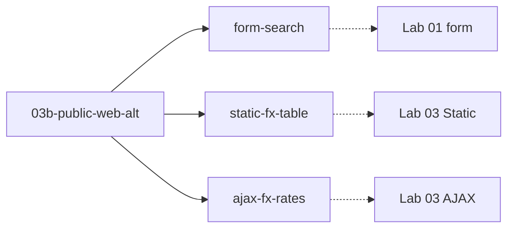

# Lab 03b — Public Web Alt

**เส้นทดแทนเมื่อ Lab Hub ถูกกั้น** (ทักษะเทียบ **01 form** + **03 table**)

**วัน:** 1 · **ระดับ:** Intermediate · **เวลาโดยประมาณ:** ตาม Lab ย่อยที่เลือก  
**สถานะ:** เส้นทดแทนสำหรับสภาพแวดล้อมที่เข้า **PAD Lab Hub** (`ontoiq.tech` / `pad.ontoiq.tech`) ไม่ได้  
**เหตุผลที่พบบ่อย:** Browser Secure Isolation / allowlist เครือข่ายองค์กร  
**โดเมนตัวอย่าง (สาธารณะ):** `*.bot.or.th` และ `*.scb.co.th` (ใช้เป็นหน้าฝึก — ไม่ใช่ lab ของลูกค้ารายใดรายหนึ่ง)

> **ใช้เมื่อไหร่:** Lab [01](../01-record-replay/README.md) / [03](../03-web-scout/README.md) เปิด Lab Hub ไม่ได้  
> **อย่าใช้แทนเมื่อ:** เข้า Lab Hub ได้ปกติ — ให้ทำ Lab มาตรฐานก่อนเสมอ

## แผนที่ Lab ทดแทน

| ลำดับ | Lab นี้ | ทักษะเทียบ | Flow | หน้าเป้าหมาย |
|------|---------|------------|------|-------------|
| 1 | [Form Search](form-search/README.md) | Lab 01 Record & Replay (form) | `Lab03b_FormSearch` | [ค้นหา ธปท.](https://www.bot.or.th/th/search.html) |
| 2 | [Static FX Table](static-fx-table/README.md) | Lab 03 Static Table | `Lab03b_StaticFxTable` | [ตารางอัตราแลกเปลี่ยน ธปท.](https://app.bot.or.th/BTWS_STAT/statistics/ReportPage.aspx?language=TH&reportID=123) |
| 3 | [AJAX FX Rates](ajax-fx-rates/README.md) | Lab 03 AJAX Table | `Lab03b_AjaxFxRates` | [อัตราแลกเปลี่ยน (สาธารณะ)](https://www.scb.co.th/th/personal-banking/foreign-exchange-rates) |



## กฎความปลอดภัย (บังคับ)

ใช้เฉพาะหน้าสาธารณะที่**ค้นหา / อ่าน / ดาวน์โหลดข้อมูลเปิด**เท่านั้น

| ทำได้ | ห้ามทำ |
|-------|--------|
| ค้นหาบน `bot.or.th` | Submit ฟอร์มสมัคร / ติดต่อ / แจ้งปัญหาจริง |
| Extract ตารางอัตราแลกเปลี่ยนสาธารณะ | Login Internet Banking / แอปธนาคาร |
| ดาวน์โหลด Excel สถิติสาธารณะของ ธปท. | กรอกข้อมูลลูกค้าจริง / เลขบัตร / บัญชี |
| ปิดคุกกี้แบบ “จำเป็นเท่านั้น” | ส่งอีเมล / แชท / ticket ออกจากเครื่อง lab |

## Prerequisites

- PAD + browser extension (แนะนำ **2607+**)
- เปิดได้ด้วยมือ:
  - `https://www.bot.or.th/th/search.html`
  - `https://app.bot.or.th/BTWS_STAT/statistics/ReportPage.aspx?language=TH&reportID=123`
  - `https://www.scb.co.th/th/personal-banking/foreign-exchange-rates`
- อ่าน [`shared/PAD-FUNDAMENTALS.md`](../../shared/PAD-FUNDAMENTALS.md)

## Output

```text
C:\PAD-Labs\output\lab03b\
  search-proof.png
  bot-fx-table.csv
  bank-fx-rates.csv
```

## Optional (ถ้าเวลาเหลือ)

| ทักษะ | หน้า | หมายเหตุ |
|-------|------|----------|
| Controls (dropdown ช่วงเวลา) | [ReportPage ธปท.](https://app.bot.or.th/BTWS_STAT/statistics/ReportPage.aspx?language=TH&reportID=123) | เปลี่ยน รายวัน/รายเดือน แล้วกดดูตาราง |
| Catalog / รายการหลายชิ้น | [ข่าว ธปท.](https://www.bot.or.th/th/news-and-media.html) | Extract หัวข่าวหลายรายการ |
| Files (download) | [อัตราแลกเปลี่ยนประจำวัน ธปท.](https://www.bot.or.th/th/statistics/exchange-rate.html) | ลิงก์ดาวน์โหลด Excel สาธารณะ |
| Branch search (กรอก + ค้นหา) | [ค้นหาจุดบริการ (สาธารณะ)](https://www.scb.co.th/th/corporate-banking/tools/services-locator/) | ค้นหาสาขา/ATM — **อย่า**ส่งข้อความติดต่อธนาคาร |

## ข้อจำกัดที่ต้องรู้

- Catch-up `scripts/*.robin` **bundle UI Elements** แล้ว (`# [ControlRepository]`) ด้วย custom CSS จากหน้าสาธารณะ — paste ลง empty flow ไม่ต้อง Capture ก่อนรัน Wait/Populate/Click
- Selector บนเว็บจริง**ไม่มี** `data-pad` แบบ Lab Hub — ถ้า DOM เปลี่ยน ให้ **Repair / Test selector** ใน designer (อย่าแก้ `appmask[...]` path ด้วยมือ)
- Extract Entire HTML Table ยังต้องตั้งใน designer (แบบ Lab 03) — Wait ตารางผ่าน UI Element ที่ bundle มาแล้ว
- หน้า FX สาธารณะมักโหลดตารางแบบ dynamic → ต้อง **Wait for web page content** ก่อน Extract
- แบนเนอร์คุกกี้ ธปท. อาจบังหน้า — กด “จำเป็นเท่านั้น” ก่อน Interact (optional capture `Btn_CookieNecessary`)
- ถ้า Browser Secure Isolation ทำให้ **PAD extension คุมเบราว์เซอร์ไม่ได้** (remote browser) ชุดนี้แก้ไม่ได้ด้วยการเปลี่ยน URL — ต้องขอ local Edge/Chrome สำหรับ lab หรือ allowlist automation

## Rebuild catch-up

```powershell
python .cursor/skills/pad-robin/scripts/bundle-03b-public-web-appmask.py
python .cursor/skills/pad-robin/scripts/lint-robin.py modules/03b-public-web-alt
```

## บทที่เกี่ยวข้อง

- ก่อนหน้า / มาตรฐาน: [01 Record & Replay](../01-record-replay/README.md) · [03 Web Scout](../03-web-scout/README.md)
- Selector: [`shared/SELECTOR-CONVENTIONS.md`](../../shared/SELECTOR-CONVENTIONS.md)
