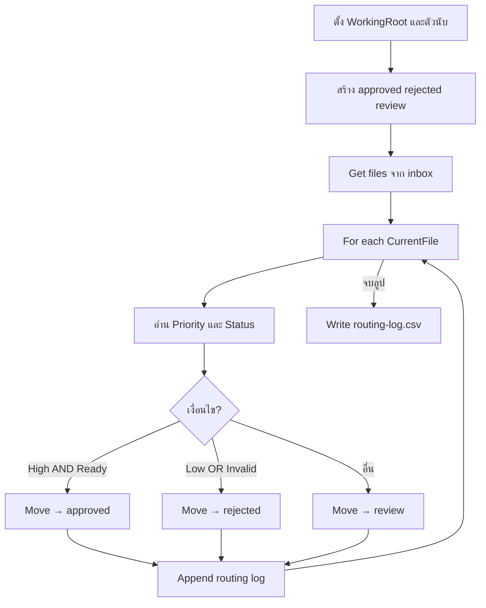

# Lab 04 — Conditional Automation (ความรู้)

**หน้าปก:** [README.md](README.md) · **ลงมือทำ:** [LAB.md](LAB.md) · **พื้นฐานร่วม:** [`shared/PAD-FUNDAMENTALS.md`](../../shared/PAD-FUNDAMENTALS.md)

**วัน:** 2 · **ระดับ:** Intermediate · **อ่านประมาณ:** 15–25 นาที

## 1. บทนี้เรียนอะไร / จบแล้วทำอะไรได้

เมื่อจบบทนี้ คุณจะ:

- อธิบายได้ว่าทำไมต้องใช้ **If / Else if / Else** แทนการ hardcode ย้ายทีละไฟล์
- แยก **AND** กับ **OR** ในกฎธุรกิจได้ถูกต้อง
- ดึง `Priority` / `Status` จากชื่อไฟล์ (หรือเนื้อหา) แล้วเปรียบเทียบข้อความ
- ใช้ **Move file(s)** ภายใน **For each** เป็นทีละไฟล์ (`%CurrentFile%`)
- เขียน `routing-log.csv` สรุปว่าไฟล์ไหนไปโฟลเดอร์ใด

## 2. เรื่องราวจากงานจริง

สมมติทีม operations มีกล่อง inbox ของคำขอ (request) ทุกเช้า: บางรายการพร้อมอนุมัติ (`High` + `Ready`) บางรายการต้องปฏิเสธทันที (`Low` หรือ `Invalid`) และที่เหลือต้องให้คนรีวิว  
ถ้าเปิดไฟล์ทีละชิ้นแล้วลากเข้าโฟลเดอร์ด้วยมือ จะช้าและพลาดกฎได้ง่าย งานของบทนี้คือสร้าง **desktop flow** ที่อ่านค่า Priority/Status จากแต่ละไฟล์ แล้ว **Move** ไป `approved` / `rejected` / `review` ตาม [`assets/business-rules.md`](assets/business-rules.md) พร้อมเขียน log

## 3. ศัพท์ทีละคำ

| ศัพท์ | ความหมายภาษาคน | เห็นที่ไหนใน PAD |
|--------|----------------|------------------|
| **Condition** | เงื่อนไขที่ตัดสินว่าจะเข้ากิ่งไหน | **If** / **Else if** |
| **AND** | ต้องเป็นจริงครบทุกข้อถึงจะเข้ากิ่ง | เงื่อนไขคู่ใน If (High **และ** Ready) |
| **OR** | เป็นจริงข้อใดข้อหนึ่งก็พอ | Else if (Low **หรือ** Invalid) |
| **Else** | กิ่งสำรองเมื่อไม่เข้าเงื่อนไขก่อนหน้า | หลัง If / Else if |
| **Priority / Status** | ค่าธุรกิจในชื่อไฟล์หรือเนื้อหา | ตัวแปรหลัง Split / Parse / Read text |
| **Move file(s)** | ย้ายไฟล์ออกจากต้นทางไปปลายทาง | Actions → File |
| **Routing log** | บันทึกว่าไฟล์ไปโฟลเดอร์ไหน | `routing-log.csv` |

## 4. แนวคิดหลัก

แนวคิดสำคัญ: **ดึงรายการ → วนทีละไฟล์ → อ่านค่าธุรกิจ → แยกทางด้วยเงื่อนไข → Move + นับ + log**

ลำดับเงื่อนไขต้องตรง business rules — สาขา approved ใช้ AND ส่วน rejected ใช้ OR ที่เหลือเข้า review



Pseudo-flow:

```text
WorkingRoot = C:\PAD-Labs\working\lab04
สร้างโฟลเดอร์ approved, rejected, review (ถ้ายังไม่มี)
InboxFiles = ไฟล์ *.txt ใน WorkingRoot\inbox
สำหรับแต่ละ CurrentFile ใน InboxFiles:
  อ่าน Priority, Status (จากชื่อไฟล์หรือเนื้อหา)
  ถ้า Priority=High และ Status=Ready → Move ไป approved; ApprovedCount++
  ไม่งั้นถ้า Priority=Low หรือ Status=Invalid → Move ไป rejected; RejectedCount++
  ไม่งั้น → Move ไป review; ReviewCount++
  ต่อท้ายแถวใน RoutingLog
เขียน routing-log.csv
```

## 5. ตาราง Action ที่จะใช้

| Action (official) | ทำอะไร | Input สำคัญ | **Variables produced** (ชื่อตอนสร้าง — ไม่มี `%`) |
|-------------------|--------|-------------|--------------------------------------|
| **Set variable** | ตั้ง path / ตัวนับ / log | Name, Value | — |
| **If folder exists** | ตรวจโฟลเดอร์ปลายทาง | Folder path | — |
| **Create folder** | สร้างโฟลเดอร์ถ้ายังไม่มี | Folder name, Into path | `NewFolder` (มักไม่ใช้ต่อ) |
| **Get files in folder** | ดึงรายการไฟล์ inbox | Folder, File filter | `InboxFiles` |
| **For each** | วนทีละไฟล์ | Value to iterate, Store into | Store into = `CurrentFile` |
| **Get file path part** | ได้ชื่อไฟล์จาก path | File path | `FileNameOnly` |
| **Split text** / **Parse text** | แยก Priority / Status จากชื่อ | Text, Delimiter | `Priority`, `Status` |
| **Read text from file** | วิธีสำรองอ่านเนื้อหา | File path | `FileText` |
| **If / Else if / Else** | แยกทางตามกฎ | เงื่อนไข AND/OR | — |
| **Move file(s)** | ย้ายทีละไฟล์ | File(s), Destination | — |
| **Increase variable** | บวกตัวนับ | ตัวแปรตัวเลข | — |
| **Write text to file** | เขียน log CSV | File path, Text | — |

## 6. เปรียบเทียบตัวเลือกที่มักสับสน

| หัวข้อ | ตัวเลือก A | ตัวเลือก B | เลือกเมื่อไหร่ |
|--------|------------|------------|----------------|
| เงื่อนไข approved | High **AND** Ready | High **OR** Ready | ต้องใช้ **AND** ตาม business rules |
| เงื่อนไข rejected | Low **OR** Invalid | Low **AND** Invalid | ต้องใช้ **OR** — ข้อใดข้อหนึ่งก็ปฏิเสธ |
| เป้าหมาย Move | `%CurrentFile%` | `%InboxFiles%` | **ต้องใช้ CurrentFile** ในลูป |
| อ่านค่าธุรกิจ | Parse จากชื่อไฟล์ | Read text จากเนื้อหา | แนะนำ parse ชื่อ — เนื้อหาเป็นทางสำรอง |
| Copy vs Move | **Copy file(s)** | **Move file(s)** | Lab นี้ใช้ **Move** (inbox ว่างหลังรัน — ต้องรีเซ็ตจาก assets) |

## 7. กฎ `%` และ Variables pane

- ช่อง **Name** / **Store into** / **Variables produced** → พิมพ์ `WorkingRoot`, `CurrentFile`, `Priority` (**ไม่มี `%`**)
- ช่อง Folder / path / เงื่อนไข If / ข้อความ log → `%WorkingRoot%\inbox`, `%Priority%`, `%CurrentFile%` (**มี `%`**)
- รายละเอียดเต็ม: [`shared/PAD-FUNDAMENTALS.md`](../../shared/PAD-FUNDAMENTALS.md)

## 8. จุดที่มือใหม่พลาดบ่อย

| อาการ | สาเหตุที่พบบ่อย | วิธีสังเกต |
|-------|-----------------|------------|
| ไฟล์ High-New ไป approved | ใช้ OR แทน AND ที่สาขา approved | เทียบ expected: `REQ-L1005` ต้องอยู่ review |
| High-Invalid ไม่ถูกปฏิเสธ | ลืมสาขา OR ของ Invalid | ดู `REQ-L1004` ต้องอยู่ rejected |
| เงื่อนไขไม่เข้าเลย | ตัวพิมพ์ไม่ตรง / ไม่ Trim / parse ผิดตำแหน่ง | Run next action ดู `%Priority%` `%Status%` |
| Move ทั้งชุดซ้ำ | ใส่ `%InboxFiles%` ใน Move | จำนวนไฟล์ในปลายทางผิดปกติ |
| นับไม่ตรงตอนรันซ้ำ | ไม่รีเซ็ต inbox หลัง Move | คัดลอก `assets/inbox` ทับ working ก่อนรันใหม่ |

## 9. คำถามทบทวน

**1.** ไฟล์ `REQ-L1001-High-Ready.txt` ควรไปโฟลเดอร์ใด และเพราะเงื่อนไขแบบใด?

<details>
<summary>เฉลย</summary>
ไป <code>approved</code> เพราะ <code>Priority=High</code> <strong>และ</strong> <code>Status=Ready</code> (AND) ตาม business rules
</details>

**2.** ทำไม `REQ-L1004-High-Invalid.txt` ถึงเป็น rejected ทั้งที่ Priority เป็น High?

<details>
<summary>เฉลย</summary>
สาขา rejected ใช้ OR — <code>Status=Invalid</code> ข้อเดียวก็พอให้เข้า rejected แม้ Priority จะเป็น High
</details>

**3.** ตอน **Set variable** ตั้งชื่อ `ApprovedCount` ควรพิมพ์แบบไหนในช่อง Name?

<details>
<summary>เฉลย</summary>
พิมพ์ <code>ApprovedCount</code> — <strong>ไม่ใส่</strong> <code>%</code> (ตอนอ้างอิงในข้อความค่อยใช้ <code>%ApprovedCount%</code>)
</details>

**4.** ใน **For each** ทำไมต้อง **Move** `%CurrentFile%` ไม่ใช่ `%InboxFiles%`?

<details>
<summary>เฉลย</summary>
<code>InboxFiles</code> คือรายการทั้งชุด — ถ้า Move ทั้งลิสต์จะย้ายผิดเจตนา “ทีละไฟล์ตามเงื่อนไขของไฟล์นั้น”
</details>

**5.** หลังรัน Lab สำเร็จ ทำไมต้องคัดลอก `assets/inbox` กลับก่อนสาธิตซ้ำ?

<details>
<summary>เฉลย</summary>
เพราะใช้ <strong>Move file(s)</strong> — ไฟล์ออกจาก inbox ไปโฟลเดอร์ปลายทางแล้ว ถ้าไม่รีเซ็ตจาก assets จะไม่มีไฟล์ให้รันรอบถัดไป
</details>

## 10. อ้างอิง (Aug 2026)

| แหล่ง | URL |
|-------|-----|
| Folder actions | https://learn.microsoft.com/power-automate/desktop-flows/actions-reference/folder |
| File actions | https://learn.microsoft.com/power-automate/desktop-flows/actions-reference/file |
| Getting started (file pattern) | https://learn.microsoft.com/power-automate/desktop-flows/getting-started-freeorg |
| รายการแหล่งใน Lab Kit | [PAD version matrix](https://learn.microsoft.com/power-platform/released-versions/power-automate-desktop) |

---

**ถัดไป:** เปิด [LAB.md](LAB.md) แล้วทำ Hands-on ทีละขั้น
