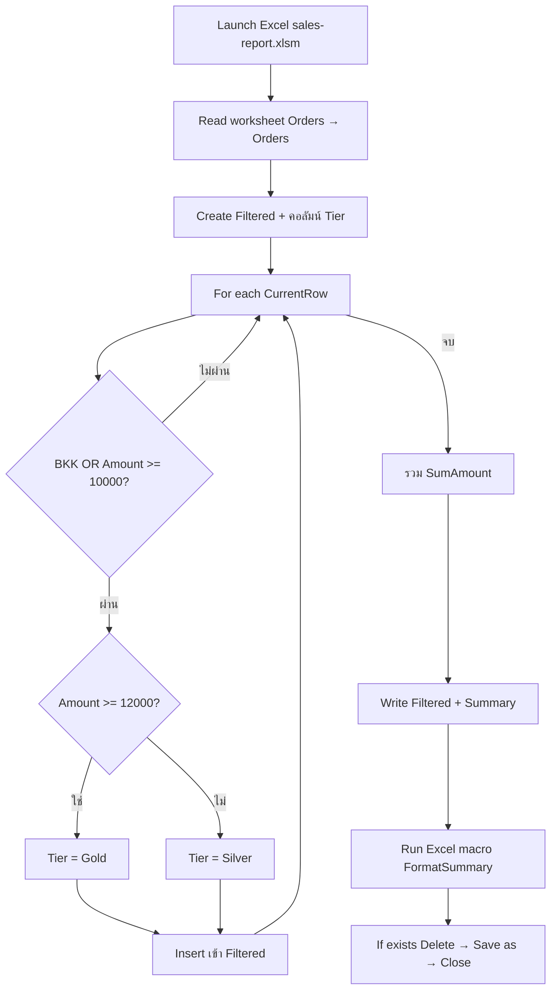

# Lab 06 — Data Table & Excel (ความรู้)

**หน้าปก:** [README.md](README.md) · **ลงมือทำ:** [LAB.md](LAB.md) · **พื้นฐานร่วม:** [`shared/PAD-FUNDAMENTALS.md`](../../shared/PAD-FUNDAMENTALS.md)

**วัน:** 2 · **ระดับ:** Intermediate · **อ่านประมาณ:** 15–25 นาที

## 1. บทนี้เรียนอะไร / จบแล้วทำอะไรได้

เมื่อจบบทนี้ คุณจะ:

- เปิด workbook ด้วย **Launch Excel** แล้วอ่านแผ่น `Orders` เป็น Data table
- กรองแถวด้วยเงื่อนไข `Region = BKK` **หรือ** `Amount >= 10000`
- ตั้งคอลัมน์ `Tier` (`Gold` / `Silver`) แล้วเขียน sheet `Filtered` + `Summary`
- รัน **Run Excel macro** ชื่อ `FormatSummary` (Mission M)
- บันทึก output แบบรันซ้ำได้ด้วย **If file exists** → **Delete file** ก่อน **Save document as** แล้ว **Close Excel**

## 2. เรื่องราวจากงานจริง

สมมติทีม analyst ได้ workbook ยอดขายรายวัน และต้องตัดรายงานเฉพาะออเดอร์ที่สำคัญ (กรุงเทพ หรือยอดสูง) พร้อมจัดระดับลูกค้าเป็น Gold/Silver แล้วจัดฟอร์แมตด้วย macro ที่มีอยู่แล้วในองค์กร  
ถ้าทำมือทุกครั้งจะช้าและฟอร์แมตไม่สม่ำเสมอ งานของบทนี้คือสร้าง **desktop flow** ที่อ่าน Excel → กรอง/เพิ่ม Tier ใน Data table → เขียน sheet ผลลัพธ์ → รัน macro `FormatSummary` → บันทึก `orders-report.xlsm` ลง output โดยรันซ้ำแล้วไม่พังเพราะไฟล์ซ้ำ

## 3. ศัพท์ทีละคำ

| ศัพท์ | ความหมายภาษาคน | เห็นที่ไหนใน PAD |
|--------|----------------|------------------|
| **Excel instance** | เซสชัน Excel ที่ flow เปิดอยู่ | produced ของ **Launch Excel** เช่น `Excel` |
| **Data table** | ตารางในหน่วยความจำของ flow | หลัง **Read from Excel worksheet** |
| **Filter** | คัดเฉพาะแถวที่เข้าเงื่อนไข | **If** ภายใน **For each** |
| **Tier** | ระดับที่คำนวณจาก Amount | ตัวแปร / คอลัมน์ใหม่ในตาราง |
| **Worksheet** | แผ่นงานใน workbook | ชื่อ sheet เช่น `Orders`, `Filtered`, `Summary` |
| **Macro / VBA** | สคริปต์ใน Excel จัดฟอร์แมต | **Run Excel macro** |
| **`.xlsm`** | workbook ที่เก็บ macro ได้ | ต่างจาก `.xlsx` ที่ไม่มี VBA |
| **Save document as** | บันทึกเป็น path ใหม่ | กลุ่ม Excel actions |

## 4. แนวคิดหลัก

แนวคิดสำคัญ: **อ่านทั้งแผ่น → วนแถวกรองและตั้ง Tier → สรุปยอด → เขียนกลับ Excel → รัน macro → บันทึกแบบ idempotent → ปิด instance**

เงื่อนไขกรองใช้ OR; เงื่อนไข Tier ใช้เกณฑ์ Amount แยกต่างหาก



Pseudo-flow:

```text
WorkingRoot = C:\PAD-Labs\working\lab06
OutputPath = C:\PAD-Labs\output\lab06\orders-report.xlsm
Launch Excel → Excel instance
อ่านแผ่น Orders → Orders (มี column names)
สร้าง Filtered (คอลัมน์ต้นทาง + Tier)
สำหรับแต่ละ CurrentRow ใน Orders:
  ถ้า Region=BKK หรือ Amount>=10000:
    ถ้า Amount>=12000 → Tier=Gold ไม่งั้น Tier=Silver
    Insert แถวเข้า Filtered
รวม SumAmount จาก Filtered
เขียน sheet Filtered และ Summary
Run Excel macro FormatSummary
ถ้ามีไฟล์ที่ OutputPath → Delete
Save document as → OutputPath
Close Excel
```

Expected สรุปแนว [`assets/expected-summary.csv`](assets/expected-summary.csv): FilteredRowCount=4, SumAmount=56000, GoldCount=3, SilverCount=1

## 5. ตาราง Action ที่จะใช้

| Action (official) | ทำอะไร | Input สำคัญ | Produced (ชื่อตอนสร้าง — ไม่มี `%`) |
|-------------------|--------|-------------|--------------------------------------|
| **Set variable** | ตั้ง path / SumAmount / Tier | Name, Value | — |
| **Launch Excel** | เปิด workbook | Document path | `Excel` |
| **Read from Excel worksheet** | อ่านแผ่นเป็นตาราง | Excel instance, Worksheet | `Orders` |
| **Create new data table** | ตารางผลกรอง | ชื่อคอลัมน์ + Tier | `Filtered` |
| **For each** | วนแถว | Value to iterate, Store into | `CurrentRow` |
| **If / Else** | กรองและตั้ง Tier | เงื่อนไข Region/Amount | — |
| **Insert row into data table** | เพิ่มแถวที่ผ่านกรอง | Data table, ค่าคอลัมน์ | — |
| **Increase variable** | รวมยอด | `SumAmount` | — |
| **Write to Excel worksheet** | เขียน Filtered / Summary | Excel instance, Worksheet | — |
| **Run Excel macro** | รัน VBA จัดฟอร์แมต | Excel instance, Macro name | — |
| **If file exists** | ตรวจไฟล์ output เก่า | File path | — |
| **Delete file** | ลบไฟล์เก่าก่อน Save as | File path | — |
| **Save document as** | บันทึกไป output | Excel instance, path | — |
| **Close Excel** | ปิด instance | Excel instance | — |

## 6. เปรียบเทียบตัวเลือกที่มักสับสน

| หัวข้อ | ตัวเลือก A | ตัวเลือก B | เลือกเมื่อไหร่ |
|--------|------------|------------|----------------|
| เงื่อนไขกรอง | BKK **OR** Amount≥10000 | BKK **AND** Amount≥10000 | ต้องใช้ **OR** ตามโจทย์ |
| Tier | Gold ถ้า Amount≥12000 | Gold ถ้า Region=BKK | Tier ดูจาก Amount เท่านั้น |
| ไฟล์ macro | `.xlsm` + `FormatSummary` | `.xlsx` ไม่มี macro | Mission M ต้อง `.xlsm` |
| บันทึกรอบสอง | If exists → Delete → Save as | Save as ทับตรง ๆ | ต้องลบก่อนเพื่อรันซ้ำได้ |
| ปิด Excel | **Close Excel** ท้าย flow | ปล่อย instance ค้าง | ต้องปิดทุกครั้ง |

## 7. กฎ `%` และ Variables pane

- ช่อง **Name** / **Store into** / ชื่อ produced → `WorkingRoot`, `Excel`, `Orders`, `Filtered`, `Tier` (**ไม่มี `%`**)
- ช่อง Document path / Excel instance / เงื่อนไข / ค่าแถว → `%WorkingRoot%\sales-report.xlsm`, `%Excel%`, `%CurrentRow['Region']%` (**มี `%`**)
- รายละเอียดเต็ม: [`shared/PAD-FUNDAMENTALS.md`](../../shared/PAD-FUNDAMENTALS.md)

## 8. จุดที่มือใหม่พลาดบ่อย

| อาการ | สาเหตุที่พบบ่อย | วิธีสังเกต |
|-------|-----------------|------------|
| Save as รอบสองล้ม | ไม่ลบไฟล์ output เก่า | เพิ่ม **If file exists** → **Delete file** |
| Macro not found | ไฟล์ยังเป็น `.xlsx` / ชื่อ macro ผิด | ใช้ `.xlsm` และ macro = `FormatSummary` |
| จำนวนแถวไม่ตรง 4 | ใช้ AND แทน OR / ไม่แปลงตัวเลข | เทียบ `expected-summary.csv` |
| File locked | Excel UI เปิดไฟล์ค้าง | ปิดหน้าต่าง Excel มือ + ตรวจ **Close Excel** ใน flow |
| เขียนทับ repo | ทำงานบน `assets/` โดยตรง | คัดลอกไป `working\lab06` ก่อนเสมอ |

## 9. คำถามทบทวน

**1.** เงื่อนไขกรองแถวใน Lab นี้คืออะไร — AND หรือ OR?

<details>
<summary>เฉลย</summary>
<code>Region = BKK</code> <strong>หรือ</strong> <code>Amount &gt;= 10000</code> (OR) — แถวที่เข้าข้อใดข้อหนึ่งจะถูกเก็บใน <code>Filtered</code>
</details>

**2.** คอลัมน์ `Tier` ตั้งค่าอย่างไร?

<details>
<summary>เฉลย</summary>
ถ้า Amount &gt;= 12000 → <code>Gold</code> ไม่เช่นนั้น → <code>Silver</code> (ตั้งด้วย <strong>If</strong> ซ้อนหลังผ่านเงื่อนไขกรองแล้ว)
</details>

**3.** ทำไมต้องใช้ไฟล์ `.xlsm` สำหรับ Mission M?

<details>
<summary>เฉลย</summary>
เพราะต้องรัน <strong>Run Excel macro</strong> ชื่อ <code>FormatSummary</code> — workbook แบบ <code>.xlsx</code> เก็บ VBA ไม่ได้ตามที่ Lab ต้องการ
</details>

**4.** ก่อน **Save document as** ไป path output คงที่ ควรทำอะไรเพื่อให้รันซ้ำได้?

<details>
<summary>เฉลย</summary>
ใช้ <strong>If file exists</strong> แล้ว <strong>Delete file</strong> ที่ <code>%OutputPath%</code> ก่อน Save as — กัน error ชื่อไฟล์ซ้ำ
</details>

**5.** ช่อง produced ของ **Launch Excel** ควรตั้งชื่ออย่างไร และตอนอ้างอิงใน action ถัดไปใช้อย่างไร?

<details>
<summary>เฉลย</summary>
ชื่อตอนสร้าง เช่น <code>Excel</code> (<strong>ไม่มี</strong> <code>%</code>) — ตอนใส่ใน Excel instance ของ Read/Write/Macro/Close ใช้ <code>%Excel%</code>
</details>

## 10. อ้างอิง (Aug 2026)

| แหล่ง | URL |
|-------|-----|
| Excel actions | https://learn.microsoft.com/power-automate/desktop-flows/actions-reference/excel |
| Excel troubleshooting | https://learn.microsoft.com/troubleshoot/power-platform/power-automate/desktop-flows/office-automation/excel/troubleshoot-excel-errors |
| Coding guidelines | https://learn.microsoft.com/power-automate/guidance/desktop-flow-coding-guidelines/ |
| รายการแหล่งใน Lab Kit | [PAD version matrix](https://learn.microsoft.com/power-platform/released-versions/power-automate-desktop) |

---

**ถัดไป:** เปิด [LAB.md](LAB.md) แล้วทำ Hands-on ทีละขั้น
