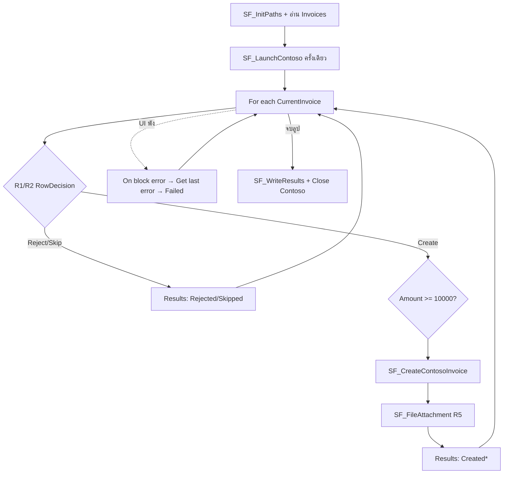

# Lab 07 — Contoso Invoice Ops (ความรู้)

**หน้าปก:** [README.md](README.md) · **ลงมือทำ:** [LAB.md](LAB.md) · **พื้นฐานร่วม:** [`shared/PAD-FUNDAMENTALS.md`](../../shared/PAD-FUNDAMENTALS.md)

**วัน:** 2 · **ระดับ:** Advanced · **อ่านประมาณ:** 25–35 นาที

## 1. บทนี้เรียนอะไร / จบแล้วทำอะไรได้

เมื่อจบบทนี้ คุณจะ:

- อธิบายได้ว่า **Desktop UI automation** ต่างจาก Web Lab Hub อย่างไร และทำไมต้อง capture **UI Elements** ไม่พึ่งพิกัดจอ
- ติดตั้งและสำรวจแอป [Contoso Invoicing](https://github.com/MicrosoftDocs/mslearn-developer-tools-power-platform/tree/master/power-automate-desktop/contoso-invoice-app) ได้
- อ่าน batch จาก Excel แล้วสร้าง invoice ใน Contoso ด้วยลูป + กฎธุรกิจ **R1–R6**
- แยก Subflow ตามหน้าที่ (Init / Launch / Validate / Create / Attach / Write / Log)
- กู้ error รายแถวด้วย **On block error** + **Get last error** โดยไม่ให้ทั้ง flow ตาย

## 2. เรื่องราวจากงานจริง

ทีมบัญชีรับชุดใบแจ้งหนี้เป็น Excel ทุกวัน: บางแถวข้อมูลไม่ครบ บางแถวถูกทำเครื่องหมาย Skip บางแถวจำนวนเงินสูงต้องทำ Priority และบางแถวมีไฟล์แนบที่ต้องจัดเก็บ  
ถ้าพิมพ์มือทีละใบในแอป Contoso จะช้าและพลาดง่าย — งานของบทนี้คือสร้าง desktop flow ที่อ่าน batch → ตรวจกฎ → กรอกฟอร์ม Desktop → เขียน Results/Summary กลับ Excel พร้อม log เมื่อ UI พังแถวใดแถวหนึ่ง

Lab ส่วนใหญ่ของคอร์สฝึกกับ **Web UI** บน [PAD Lab Hub](https://ontoiq.tech/pad/) — Lab นี้โฟกัส **Element UI บนแอป Windows จริง** เพื่อให้ Desktop RPA ครบและซับซ้อนขึ้น

## 3. ศัพท์ทีละคำ

| ศัพท์ | ความหมายภาษาคน | เห็นที่ไหนใน PAD |
|--------|----------------|------------------|
| **Contoso Invoicing** | แอป Windows ตัวอย่างจาก Microsoft Learn สำหรับฝึก invoice | ติดตั้งจาก zip / Start menu |
| **UI Element** | ปุ่ม/ช่องข้อความที่ capture จากหน้าต่าง Desktop | แผง UI elements ใน designer |
| **Selector** | ข้อมูลที่ใช้หา element ซ้ำ (ไม่ใช่พิกัดจอ) | คุณสมบัติของ UI element |
| **Run application** | เปิด `.exe` ของ Contoso | Actions → System |
| **Wait for window content** | รอจนหน้าต่าง/คอนโทรลพร้อม | UI automation |
| **Populate text field in window** | พิมพ์ค่าลงช่องในแอป Desktop | UI automation |
| **Subflow** | ชุดขั้นตอนแยกชื่อ เรียกด้วย Run subflow | แถบ Subflows |
| **On block error** | ครอบชุด action — ถ้าพังให้ทำกู้แล้ว Continue | Error handling |
| **Get last error** | อ่านข้อความ/ตำแหน่ง error ล่าสุดเพื่อ log | produced = `LastError` |
| **R1–R6** | กฎธุรกิจของ Lab นี้ (validate → attach → continue) | [`assets/business-rules.md`](assets/business-rules.md) |

## 4. แนวคิดหลัก

แนวคิดสำคัญ: **Excel เป็นแหล่งความจริงของ batch → Contoso เป็นระบบปฏิบัติการ → Excel/log เป็นหลักฐานผลลัพธ์**  
เปิดแอป **ครั้งเดียว** ก่อนลูป แล้วภายในแต่ละแถว: Validate → (Create UI) → Attachment → เขียน Results — ครอบด้วย **On block error** ตาม R6



Pseudo-flow:

```text
Init paths + CreatedCount/FailedCount
อ่าน Invoices จาก Excel → Data table
Launch Contoso ครั้งเดียว (Wait + Focus)
สำหรับแต่ละ CurrentInvoice:
  On block error (SET-only ใน handler):
    ตรวจ R1/R2 → Reject/Skip แล้วข้าม UI
    ถ้า Create: ตั้ง Priority ตาม R3/R4 แล้วกรอกฟอร์ม Contoso
    หลัง Created: หาไฟล์แนบ InvoiceId* แล้ว Copy ไป filed\{InvoiceId}\ (R5)
    Insert Results
  เมื่อ RowFailed (นอก handler):
    Get last error → ErrorMessage=%LastError.Message% → log → FailedCount → แถวถัดไป (R6)
เขียน Results + Summary → Close Contoso
```

### Contoso / Desktop UI (ภาพรวม)

- Capture ตาม [`assets/ui-map.md`](assets/ui-map.md): หน้าต่างหลัก, เมนู Invoices, ฟอร์ม New Invoice, ปุ่ม Save
- ลำดับมือที่ควรลองก่อนทำ flow: Launch → Invoices → New Invoice → Populate → Save
- หลีกเลี่ยงพิกัดจอ; ใช้ **Focus window** เมื่อหน้าต่างถูกบัง; elevation ของ PAD กับ Contoso ควรตรงกัน (UIPI)

### กฎธุรกิจ R1–R6 (ภาพรวม)

| Rule | สาระ |
|------|------|
| **R1 Validate** | Account ว่าง หรือ Amount ไม่ใช่ตัวเลข / <= 0 → `Rejected` ไม่แตะ Contoso |
| **R2 Skip** | `ProcessFlag=Skip` → `Skipped` |
| **R3 Priority** | `Amount >= 10000` → `Priority=High` + Notes มี `HIGH PRIORITY` |
| **R4 Standard** | นอกนั้น `Priority=Normal` สร้างตามปกติ |
| **R5 Attachment** | มีไฟล์ `attachments\{InvoiceId}.*` → Copy ไป `filed\{InvoiceId}\` |
| **R6 Continue** | UI แถวล้ม → log + Failed แล้วทำแถวถัดไป |

## 5. ตาราง Action ที่จะใช้

| Action (official) | ทำอะไร | Input สำคัญ | **Variables produced** (ชื่อตอนสร้าง — ไม่มี `%`) |
|-------------------|--------|-------------|--------------------------------------|
| **Set variable** | path / ตัวนับ / decision | Name, Value | — |
| **Run application** | เปิด Contoso | Application path | process/window ตาม action |
| **Wait for window content** | รอ UI พร้อม | UI element / window | — |
| **Focus window** | ดึงหน้าต่างขึ้นหน้า | Window | — |
| **Click UI element in window** / **Press button in window** | คลิกเมนู/ปุ่ม | UI element | — |
| **Populate text field in window** | กรอกฟอร์ม | UI element, Text | — |
| **Launch Excel** / **Read from Excel worksheet** | อ่าน batch | path, sheet | `ExcelIn`, `Invoices` |
| **Create new data table** / **Insert row into data table** | Results | columns / row | `Results` |
| **For each** | วนทีละแถว | `%Invoices%` | Store into = `CurrentInvoice` |
| **On block error** | กู้รายแถว | นโยบาย Continue | — |
| **Get last error** | อ่าน error เพื่อ log | — | `LastError` |
| **Get files in folder** / **Copy file(s)** | R5 attachment | folder, filter | file list |
| **Write to Excel worksheet** / **Save document as** | Results + Summary | instance, path | — |
| **Close window** / **Close Excel** | cleanup | window / instance | — |
| **Run subflow** | เรียก Subflow | ชื่อ subflow | — |

## 6. เปรียบเทียบตัวเลือกที่มักสับสน

| หัวข้อ | ตัวเลือก A | ตัวเลือก B | เลือกเมื่อไหร่ |
|--------|------------|------------|----------------|
| เป้าหมาย UI | **Web** (Lab Hub) | **Desktop** (Contoso) | Lab นี้ = Desktop UI elements |
| การคลิก | **UI Element** ที่ capture | พิกัดจอ / Recorder อย่างเดียว | ใช้ UI Element เป็นหลัก |
| Error รายแถว | **On block error** (SET-only) + **Get last error** นอก handler + Continue | ให้ทั้ง flow Terminate / ใส่ Get last error ใน handler | R6 ต้อง Continue — Lab 09/09b จะทบทวนแพทเทิร์นนี้ |
| Reject/Skip | ไม่เปิดฟอร์ม Contoso | ยังกรอก UI แล้วค่อยลบ | R1/R2 ห้ามแตะ Create UI |
| Path Contoso | `%ContosoPath%` จากเครื่องจริง | hardcode คนละเครื่อง | หา exe จาก Task Manager |
| โครงสร้าง | Subflows ≥ 3 | ยัดทั้งหมดใน Main | เกณฑ์ผ่านต้องการแยกอย่างน้อย 3 |

## 7. กฎ `%` และ Variables pane

- ช่อง **Name** / **Store into** / **Variables produced** → `WorkingRoot`, `CurrentInvoice`, `LastError` (**ไม่มี `%`**)
- path / Text / Value to iterate → `%WorkingRoot%`, `%Invoices%`, `%LastError.Message%` (**มี `%`**)
- รายละเอียดเต็ม: [`shared/PAD-FUNDAMENTALS.md`](../../shared/PAD-FUNDAMENTALS.md)

## 8. จุดที่มือใหม่พลาดบ่อย

| อาการ | สาเหตุที่พบบ่อย | วิธีสังเกต |
|-------|-----------------|------------|
| Selector หลุดหลังอัปเดตแอป | พึ่ง index / พิกัด | Recapture ตาม ui-map |
| Error แถวเดียวแล้วทั้ง flow ตาย | ไม่มี On block error หรือตั้ง Terminate | ตรวจนโยบาย Continue ของบล็อก |
| Reject แล้วยังเปิดฟอร์ม | ลืม R1/R2 ก่อน Create | ดูว่า RowDecision = Reject แล้วยังมี Click New Invoice |
| Save as รอบสองพัง | ไม่ลบไฟล์ output เก่า | ใส่ **If file exists** → **Delete file** |
| Contoso เปิดไม่ได้ | Excel ใต้ Documents เป็น Confidential / path exe ผิด | ดู Q&A Contoso + Task Manager |
| UIPI ส่ง input ไม่ได้ | PAD กับแอป elevation คนละระดับ | รันที่สิทธิ์เดียวกัน |

## 9. คำถามทบทวน

**1.** ทำไม Lab นี้ไม่ใช้แค่ Web Lab Hub?

<details>
<summary>เฉลย</summary>
เพื่อฝึก <strong>Desktop UI automation</strong> บนแอป Windows จริง (Contoso) — capture UI Elements, Wait/Focus window, Populate ในหน้าต่าง ไม่ใช่แค่ browser
</details>

**2.** R1 กับ R2 ต่างกันอย่างไร และทั้งคู่ต้องทำอะไรกับ Contoso UI?

<details>
<summary>เฉลย</summary>
R1 = ข้อมูลไม่ผ่าน validate → <code>Rejected</code>; R2 = <code>ProcessFlag=Skip</code> → <code>Skipped</code> — ทั้งคู่<strong>ไม่เปิดฟอร์มสร้าง Invoice</strong>
</details>

**3.** R6 ใช้กลไก PAD ชื่ออะไร (ไม่ใช่ Try-Catch)?

<details>
<summary>เฉลย</summary>
<strong>On block error</strong> ครอบงานรายแถว (ใน handler = <strong>SET</strong> flag อย่างเดียว) แล้ว<strong>นอก</strong>บล็อกใช้ <strong>Get last error</strong> → log <code>%LastError.Message%</code> แล้ว Continue แถวถัดไป
</details>

**4.** Amount = 12000 ควรได้ Priority แบบใด และ Notes ต้องมีอะไร?

<details>
<summary>เฉลย</summary>
<code>Priority=High</code> (R3 เพราะ >= 10000) และ Notes ต้องมีข้อความ <code>HIGH PRIORITY</code>
</details>

**5.** เกณฑ์ผ่านต้องการอย่างน้อยกี่ Subflows และยกตัวอย่างชื่อได้ไหม?

<details>
<summary>เฉลย</summary>
อย่างน้อย <strong>3</strong> จากเช่น <code>SF_InitPaths</code>, <code>SF_LaunchContoso</code>, <code>SF_ValidateInvoiceRow</code>, <code>SF_CreateContosoInvoice</code>, <code>SF_FileAttachment</code>, <code>SF_WriteResults</code>, <code>SF_LogRowError</code>
</details>

## 10. อ้างอิง (Aug 2026)

| แหล่ง | URL |
|-------|-----|
| Contoso setup (Learn) | https://learn.microsoft.com/training/modules/input-parameters/2-set-up |
| Contoso sample app | https://github.com/MicrosoftDocs/mslearn-developer-tools-power-platform/tree/master/power-automate-desktop/contoso-invoice-app |
| UI automation actions | https://learn.microsoft.com/power-automate/desktop-flows/actions-reference/uiautomation |
| Handle errors | https://learn.microsoft.com/power-automate/desktop-flows/errors |
| รายการแหล่งใน Lab Kit | [PAD version matrix](https://learn.microsoft.com/power-platform/released-versions/power-automate-desktop) |

---

**ถัดไป:** เปิด [LAB.md](LAB.md) — ติดตั้ง Contoso แล้วทำ Hands-on ทีละขั้น
