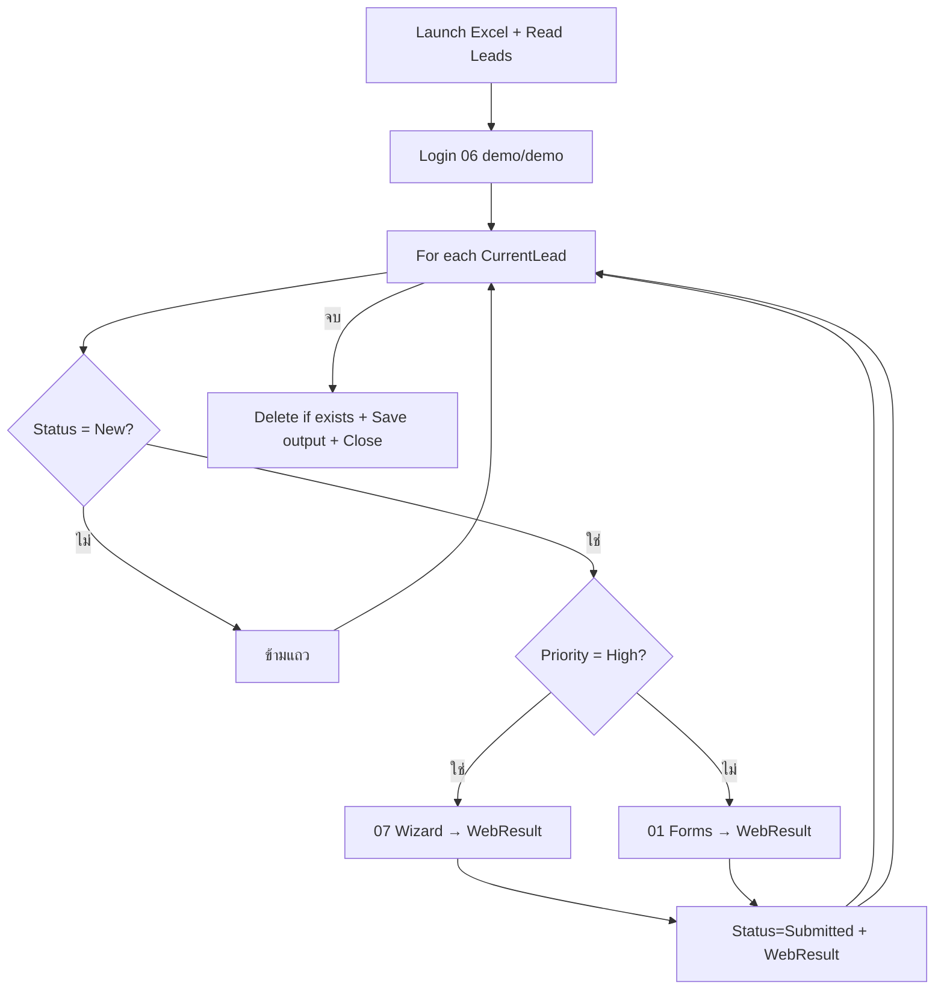

# Lab 08 — Excel ↔ Web Round-trip (ความรู้)

**หน้าปก:** [README.md](README.md) · **ลงมือทำ:** [LAB.md](LAB.md) · **พื้นฐานร่วม:** [`shared/PAD-FUNDAMENTALS.md`](../../shared/PAD-FUNDAMENTALS.md)

**วัน:** 2 · **ระดับ:** Intermediate–Advanced · **อ่านประมาณ:** 15–25 นาที

## 1. บทนี้เรียนอะไร / จบแล้วทำอะไรได้

เมื่อจบบทนี้ คุณจะ:

- อธิบายแพทเทิร์นธุรกิจสั้น **Excel → Web → Excel** (round-trip)
- Login [PAD Lab Hub](https://ontoiq.tech/pad/) แล้ววน lead จาก Excel ด้วย **For each**
- แยกเส้นทาง **Forms (01)** กับ **Wizard (07)** ตาม Priority
- อัปเดต Status / WebResult กลับ workbook แยกจากไฟล์ input
- ปิด Excel และ browser สะอาด และออกแบบให้รันซ้ำที่ path output เดิมได้

## 2. เรื่องราวจากงานจริง

ฝ่ายขายส่งรายชื่อ leads ใน Excel: สถานะ `New` ต้องถูกติดตามบนพอร์ทัลภายใน  
งานมือคือเปิดเบราว์เซอร์ login → กรอกฟอร์มทีละคน → คัดลอกข้อความยืนยันกลับไปใส่ Excel — ช้าและคอลัมน์ WebResult มักว่าง  
Flow ของบทนี้ทำ round-trip ให้: อ่านแถว → submit บน Lab Hub → เขียน `Submitted` + ข้อความผลลัพธ์กลับไฟล์ output

## 3. ศัพท์ทีละคำ

| ศัพท์ | ความหมายภาษาคน | เห็นที่ไหนใน PAD |
|--------|----------------|------------------|
| **Round-trip** | ข้อมูลออกจาก Excel ไป Web แล้วกลับมาอัปเดต Excel | ทั้ง flow Lab 08 |
| **Lab Hub** | เว็บฝึก PAD ของคอร์ส (`ontoiq.tech/pad`) | Launch browser / Go to web page |
| **Data table / Data row** | ตารางและแถวปัจจุบันในลูป | `Leads`, `CurrentLead` |
| **Mission W** | lead `Priority=High` ต้องใช้ Wizard ไม่ใช่ Forms อย่างเดียว | หน้า 07-wizard |
| **WebResult** | ข้อความ/ผลจากหน้าเว็บหลัง submit | คอลัมน์ใน output |
| **Live web helper** | ตัวช่วยชี้ element/extract บนหน้าเว็บ | Extract data from web page |
| **Save document as** | บันทึก workbook ไป path output | Excel actions |
| **If file exists → Delete file** | ลบไฟล์เก่าก่อน Save as เพื่อรันซ้ำได้ | File actions |

## 4. แนวคิดหลัก

แนวคิดสำคัญ: **แหล่งข้อมูลต้องมาจาก Excel จริง + ลูป** — ห้าม hardcode lead ทั้งชุดลงตัวแปร  
ลำดับ session: **Login ก่อน** แล้วค่อย Forms/Wizard → อัปเดตในหน่วยความจำ → เขียนไฟล์ output คนละ path กับ input



Pseudo-flow:

```text
WorkingRoot / OutputPath
อ่าน Leads จาก leads-input.xlsx
Launch browser → 06-login (demo/demo)
สำหรับแต่ละ CurrentLead:
  ถ้า Status ≠ New → ข้าม
  ถ้า Priority = High → Wizard 07
  ไม่งั้น → Forms 01
  อัปเดต Status=Submitted, WebResult, SubmittedAt
If output มีอยู่ → Delete
เขียนตารางกลับ Excel → Save as OutputPath
Close Excel + Close browser
```

## 5. ตาราง Action ที่จะใช้

| Action (official) | ทำอะไร | Input สำคัญ | Produced (ชื่อตอนสร้าง — ไม่มี `%`) |
|-------------------|--------|-------------|--------------------------------------|
| **Set variable** | path / WebResult / SubmittedAt | Name, Value | — |
| **Launch Excel** | เปิด workbook | File path | `Excel` |
| **Read from Excel worksheet** | อ่านตาราง leads | instance, sheet | `Leads` |
| **Launch new Microsoft Edge** / **Chrome** | เปิดเบราว์เซอร์ | Initial URL | `Browser` |
| **Wait for web page content** | รอ element พร้อม | UI element | — |
| **Populate text field on web page** | กรอกช่อง | UI element, Text | — |
| **Press button on web page** / **Click link on web page** | Submit / นำทาง | UI element | — |
| **Go to web page** | เปลี่ยน URL ใน session | URL, Browser | — |
| **Extract data from web page** | ดึงข้อความผลลัพธ์ | live web helper | `WebResult` (หรือ Set variable) |
| **For each** / **If** | วนแถว + แยก Priority | `%Leads%`, เงื่อนไข | `CurrentLead` |
| **Write to Excel worksheet** | เขียนผลกลับ | instance, data | — |
| **If file exists** / **Delete file** | นโยบายรันซ้ำ | `%OutputPath%` | — |
| **Save document as** | บันทึก output | path | — |
| **Close Excel** / **Close web browser** | cleanup | instance | — |

## 6. เปรียบเทียบตัวเลือกที่มักสับสน

| หัวข้อ | ตัวเลือก A | ตัวเลือก B | เลือกเมื่อไหร่ |
|--------|------------|------------|----------------|
| แหล่ง lead | **Read from Excel** + For each | Hardcode ทีละคนในตัวแปร | Lab บังคับอ่านจาก Excel |
| เส้นทาง High | **07 Wizard** | 01 Forms อย่างเดียว | Mission W: High → Wizard |
| ไฟล์ผลลัพธ์ | `leads-output.xlsx` คนละ path | ทับ input เดิมโดยไม่ตั้งใจ | แยก OutputPath ชัด |
| รันซ้ำ | Delete ก่อน Save as / เปิดเดิมแล้ว Save | Save as ทับชื่อซ้ำโดยไม่จัดการ | เกณฑ์ Acceptance |
| Login | ทำ 06 ก่อนลูป | กระโดดไป Forms ตรง ๆ | session ต้องมีก่อน |

## 7. กฎ `%` และ Variables pane

- Name / Store into / produced → `WorkingRoot`, `CurrentLead`, `WebResult` (**ไม่มี `%`**)
- ตอนอ้างอิงคอลัมน์แถว → เช่น `%CurrentLead['Priority']%` (**มี `%`**)
- รายละเอียดเต็ม: [`shared/PAD-FUNDAMENTALS.md`](../../shared/PAD-FUNDAMENTALS.md)

## 8. จุดที่มือใหม่พลาดบ่อย

| อาการ | สาเหตุที่พบบ่อย | วิธีสังเกต |
|-------|-----------------|------------|
| Element ไม่เจอ | ไม่ Wait ก่อน Interact | เพิ่ม **Wait for web page content** |
| High ยังไป Forms | ลืม If Priority | ตรวจกิ่ง Mission W ใน designer |
| WebResult ว่าง | ไม่ Extract / ไม่ Set หลัง submit | ดู Variables pane หลัง Run next action |
| Save as รอบสองล้ม | ไม่ลบไฟล์เก่า | ใส่ If file exists → Delete |
| Browser/Excel ค้าง | ลืม Close | ท้าย flow ต้องมี Close ทั้งคู่ |

## 9. คำถามทบทวน

**1.** Round-trip ใน Lab นี้หมายถึงอะไร?

<details>
<summary>เฉลย</summary>
อ่านข้อมูลจาก Excel → ทำงานบน Web (Login + Forms/Wizard) → เขียน Status/WebResult กลับ Excel output
</details>

**2.** บัญชี Login Lab Hub ที่ใช้คืออะไร?

<details>
<summary>เฉลย</summary>
หน้า <code>06-login.html</code> ใช้ <code>demo</code> / <code>demo</code>
</details>

**3.** Mission W บังคับอะไรกับ lead Priority=High?

<details>
<summary>เฉลย</summary>
ต้องใช้หน้า <strong>07 Wizard</strong> ไม่ใช่ Forms (01) อย่างเดียว
</details>

**4.** ทำไมห้าม hardcode lead ทั้งชุดลงตัวแปร?

<details>
<summary>เฉลย</summary>
เกณฑ์ผ่านต้องการอ่านจาก Excel จริงแล้ววนด้วย For each — softcode ทั้งชุดจะไม่สะท้อนแพทเทิร์นธุรกิจและทดสอบ schema ไม่ได้
</details>

**5.** Challenge I กับ J ทำที่หน้าใด?

<details>
<summary>เฉลย</summary>
I = <code>08-iframe.html</code> (Company มี Fabrikam); J = <code>05-files.html</code> upload <code>roundtrip-proof.txt</code>
</details>

## 10. อ้างอิง (Aug 2026)

| แหล่ง | URL |
|-------|-----|
| Web automation | https://learn.microsoft.com/power-automate/desktop-flows/automation-web |
| Web actions | https://learn.microsoft.com/power-automate/desktop-flows/actions-reference/webautomation |
| Excel actions | https://learn.microsoft.com/power-automate/desktop-flows/actions-reference/excel |
| รายการแหล่งใน Lab Kit | [PAD version matrix](https://learn.microsoft.com/power-platform/released-versions/power-automate-desktop) |

---

**ถัดไป:** เปิด [LAB.md](LAB.md) แล้วทำ Hands-on ทีละขั้น
