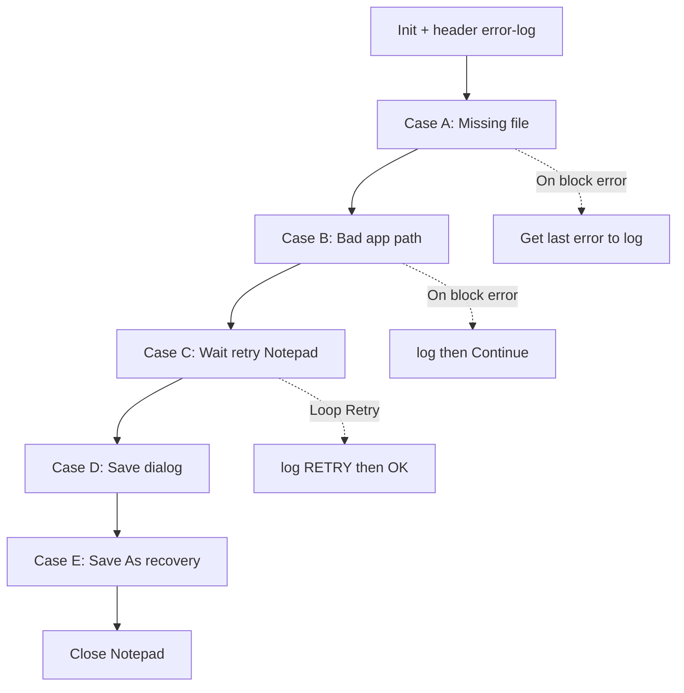

# Lab 09b — Error Handling WinApp (ความรู้)

**หน้าปก:** [README.md](README.md) · **ลงมือทำ:** [LAB.md](LAB.md) · **พื้นฐานร่วม:** [`shared/PAD-FUNDAMENTALS.md`](../../shared/PAD-FUNDAMENTALS.md)

**วัน:** 2 · **ระดับ:** Advanced · **อ่านประมาณ:** 15–20 นาที  
**ทดแทน:** [Lab 09 web](../09-error-handling/LESSON.md) เมื่อ Capture element บน browser ไม่ได้

## 1. บทนี้เรียนอะไร / จบแล้วทำอะไรได้

เมื่อจบบทนี้ คุณจะ:

- แยกได้ชัดว่า PAD **ไม่มี Action ชื่อ Try-Catch** — ใช้ **On block error**, **On error**, **Get last error**
- ออกแบบ flow ให้ทนต่อความล้มเหลวบน **Windows app (Notepad) + ไฟล์** โดยไม่พึ่ง web automation
- Log `%LastError.Message%` / `.Location%` แล้ว **Continue** งานถัดไป
- ตั้ง **Retry** อย่างจำกัดสำหรับ **Wait for window** ที่ตั้งใจให้พลาด
- Cleanup ปิด Notepad แม้มี error ระหว่างทาง และพิสูจน์ด้วย Case E (Save As recovery)

## 2. เรื่องราวจากงานจริง

ในงาน RPA จริง ไฟล์หาย, path แอปผิด, หน้าต่างยังไม่ขึ้น, และมี Save dialog เด้ขึ้นกลางทางเป็นเรื่องปกติ  
ถ้า browser ขององค์กรบล็อก Capture element ทีมยังต้องฝึก error handling บน Desktop UI ได้ — Lab นี้จำลองเคสพังทีละแบบ (A→E) แล้วบังคับให้ flow **จับ → บันทึก → ไปต่อ** จนถึง happy path ท้ายชุด

> แนวคิด “Try–Catch” ในสไลด์ **สอดคล้องกับ** On block error / On error ใน PAD — อย่าค้นหา Action ชื่อ Try-Catch ใน designer  
> อ้างอิงทางการ: [Handle errors in desktop flows](https://learn.microsoft.com/power-automate/desktop-flows/errors)

## 3. ศัพท์ทีละคำ

| ศัพท์ | ความหมายภาษาคน | เห็นที่ไหนใน PAD |
|--------|----------------|------------------|
| **On block error** | ครอบหลาย action เป็นบล็อก — กำหนดว่าเมื่อพังจะทำอะไร | ลากเป็นโครงสร้างใน workspace |
| **On error** | นโยบายต่อ **หนึ่ง action** (Retry / Continue flow run / Throw ฯลฯ) | แท็บ/ไอคอนในหน้าต่าง action |
| **Get last error** | อ่านรายละเอียด error ล่าสุดเพื่อ log หรือตัดสินใจ | **Variables produced** = `LastError` (ชนิด Error) |
| **Retry** | ลอง action เดิมอีกครั้งตามจำนวนที่จำกัด | ภายใต้ On error ของ action หรือ Loop + Wait |
| **Continue flow run** | ไม่หยุดทั้ง flow หลัง error ของ action/บล็อก | นโยบาย On error / On block error |
| **Fault injection** | จงใจทำให้พังเพื่อทดสอบการกู้ | [`assets/fault-injection.md`](assets/fault-injection.md) |
| **Error log** | CSV ที่เก็บ Case / Message / Retry | `error-log.csv` |
| **Recovery path** | งานที่ต้องสำเร็จหลังมี error ก่อนหน้า (Case E) | Notepad Save As หลัง A–D |

## 4. แนวคิดหลัก

แนวคิดสำคัญ: **จับให้ได้ → บันทึกให้ครบ → ไปต่ออย่างควบคุม**

| กลไก | ใช้เมื่อ |
|------|---------|
| **On block error** | ครอบ “ชุดเคส” (เช่น Case A ทั้งก้อน) แล้วไปกู้รวม |
| **On error** (ของ action) | ตั้ง Retry/Continue เฉพาะ Wait หรือ action ที่ flaky |
| **Get last error** | ทุกครั้งที่ต้องการข้อความจริงสำหรับ log — อย่ากลืนเงียบ |



Pseudo-flow:

```text
เขียน header error-log.csv
Case A: On block error { อ่านไฟล์ที่ไม่มี } → Get last error → append log → Continue
Case B: On block error { Run application path ผิด } → log → Continue
Case C: เปิด Notepad → Wait title ผิด + retry ≤3 → Wait class Notepad สำเร็จ
Case D: พิมพ์ข้อความ → Close โดยไม่ Save → Don't Save → log DIALOG_HANDLED
Case E: Notepad ใหม่ → Populate → Save As → log RECOVERY_OK
Close Notepad
```

**อย่าทำ:** เรียกกลไกเหล่านี้ว่า “ใส่ Try-Catch action” ในรายงาน/สไลด์ส่งงาน

## 5. ตาราง Action ที่จะใช้

| Action (official) | ทำอะไร | Input สำคัญ | **Variables produced** (ชื่อตอนสร้าง — ไม่มี `%`) |
|-------------------|--------|-------------|--------------------------------------|
| **On block error** | ครอบชุดงาน + นโยบายเมื่อพัง | Exception handling / Continue | — |
| **Get last error** | อ่าน error ล่าสุด | — | `LastError` |
| **Set variable** | path, RetryCount, Fatal | Name, Value | — |
| **Write text to file** | header + append แถว log | `%ErrorLogPath%`, Text | — |
| **Read text from file** | อ่าน missing path / bad app / recovery text | file path | `MissingPath`, `BadAppPath`, `NoteText` |
| **Run application** | เปิด Notepad หรือ path ที่ตั้งใจให้พัง | Application path | `AppProcessId` |
| **Wait for window** | รอหน้าต่าง (+ retry เมื่อ title ผิด) | Title / Class | — |
| **Populate text field in window** / **Send keys** | พิมพ์ใน Notepad | UI element / keys | — |
| **Close window** | ปิด Notepad (กระตุ้น Save dialog ใน Case D) | Title/Class | — |
| **Press button in window** / **Click UI element** | Don't Save / Save | UI element | — |
| **Focus window** | Challenge H / ก่อนพิมพ์ | Title/Class | — |

## 6. เปรียบเทียบตัวเลือกที่มักสับสน

| หัวข้อ | ตัวเลือก A | ตัวเลือก B | เลือกเมื่อไหร่ |
|--------|------------|------------|----------------|
| ชื่อกลไก | **On block error / On error / Get last error** | “Try-Catch action” | **ไม่มี** Try-Catch ใน designer |
| Lab 09 vs 09b | Web Lab Hub | Notepad + ไฟล์ | Capture บน browser ได้หรือไม่ |
| ขอบเขต | **On block error** (หลายขั้น) | **On error** ต่อหนึ่ง action | ชุดเคส vs Retry ของ Wait |
| หลัง error | **Continue** + log | Terminate ทั้ง flow | Lab นี้ต้องการไปต่อถึง Case E |
| Close Notepad | Class `Notepad` (title ว่าง) | ล็อก `Untitled - Notepad` อย่างเดียว | Title เปลี่ยนหลัง Save As |

## 7. กฎ `%` และ Variables pane

- **Variables produced** ของ Get last error = `LastError` (**ไม่มี `%`**)
- ตอน log ใช้ `%LastError.Message%`, `%LastError.Location%` (**มี `%`**)
- รายละเอียดเต็ม: [`shared/PAD-FUNDAMENTALS.md`](../../shared/PAD-FUNDAMENTALS.md)

## 8. จุดที่มือใหม่พลาดบ่อย

| อาการ | สาเหตุที่พบบ่อย | วิธีสังเกต |
|-------|-----------------|------------|
| Error ถูกกลืน ไม่มีใน log | ไม่เรียก Get last error | เปิด error-log แล้วไม่มี Message |
| Retry ไม่จบ | ไม่จำกัดครั้ง | ดูรันค้างที่ Case C |
| Case E ไม่ถึง | Terminate กลางทาง / ลำดับเคสผิด | จัด A→E ตาม fault-injection |
| Close หา Notepad ไม่เจอ | ล็อก title เก่าหลัง Save As | ใช้ Class `Notepad` |
| Can't access UI elements | Elevation mismatch | ให้ PAD กับ Notepad ระดับสิทธิ์เดียวกัน |

## 9. คำถามทบทวน

**1.** ใน PAD มี Action ชื่อ Try-Catch หรือไม่?

<details>
<summary>เฉลย</summary>
<strong>ไม่มี</strong> — ใช้ <strong>On block error</strong>, <strong>On error</strong>, และ <strong>Get last error</strong>
</details>

**2.** ทำไม Lab 09b ถึงไม่ใช้ Launch browser?

<details>
<summary>เฉลย</summary>
เพื่อทดแทนเมื่อ browser บล็อก Capture element — สอนกลไก error เดียวกันบน Desktop UI (Notepad)
</details>

**3.** Case C ควรจำกัด Retry อย่างไร?

<details>
<summary>เฉลย</summary>
ใช้ Loop กับ RetryCount และ/หรือ On error → Retry รวมแล้วแนวไม่เกิน 3 ครั้ง แล้วค่อย Wait Notepad จริง
</details>

**4.** ทำไม Case E ต้องอยู่หลัง A–D?

<details>
<summary>เฉลย</summary>
เพื่อพิสูจน์ <strong>recovery</strong>: หลังมี error จริงแล้ว flow ยัง Save As Notepad ได้ และ log <code>RECOVERY_OK</code>
</details>

## 10. อ้างอิง (Aug 2026)

| แหล่ง | URL |
|-------|-----|
| Handle errors (หลักของ Lab) | https://learn.microsoft.com/power-automate/desktop-flows/errors |
| UI automation actions | https://learn.microsoft.com/power-automate/desktop-flows/actions-reference/uiautomation |
| Official terminology (Lab Kit) | [`shared/OFFICIAL-TERMINOLOGY.md`](../../shared/OFFICIAL-TERMINOLOGY.md) |

---

**ถัดไป:** เปิด [LAB.md](LAB.md) แล้วทำ fault cases A→E (และ Challenge F–H) ทีละขั้น
