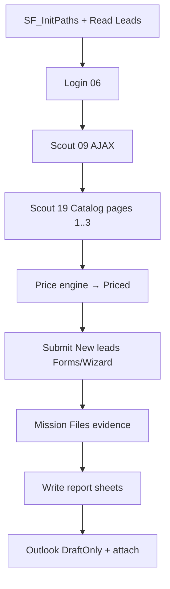

# Lab 10 — Capstone: Web Scout & Sales Operations (ความรู้)

**หน้าปก:** [README.md](README.md) · **ลงมือทำ:** [LAB.md](LAB.md) · **พื้นฐานร่วม:** [`shared/PAD-FUNDAMENTALS.md`](../../shared/PAD-FUNDAMENTALS.md)

**วัน:** 2 (Workshop) · **ระดับ:** Advanced / Capstone · **อ่านประมาณ:** 25–35 นาที

## 1. บทนี้เรียนอะไร / จบแล้วทำอะไรได้

เมื่อจบบทนี้ คุณจะ:

- รวมทักษะ Lab ก่อนหน้าเป็น pipeline เดียว: Excel → Web Scout → Pricing → Form round-trip → Report → Outlook Draft
- Scout Lab Hub อย่างน้อย AJAX + **catalog pagination** (`19-catalog`, ~24 รายการ)
- คำนวณส่วนลด/VAT ตาม [`assets/pricing-rules.md`](assets/pricing-rules.md) แล้วเขียน sheet `Priced` + `Summary`
- สร้าง Outlook message แบบ **DraftOnly** (ไม่ Send จริงในชั้นเรียน) พร้อมแนบรายงาน
- ครอบงานเสี่ยงด้วย **On block error** + log และแยก Subflows อย่างน้อย 3 ชื่อ

## 2. เรื่องราวจากงานจริง (Onto Scout Ops)

คุณคือทีม **Onto Scout Ops**  
ภารกิจ: อ่าน leads จาก Excel → สอดแนม [PAD Lab Hub](https://ontoiq.tech/pad/) หาสัญญาณออเดอร์/ราคา → คำนวณส่วนลดและภาษี → กรอกฟอร์มติดตาม → เขียนรายงานกลับ Excel → สร้างอีเมล Outlook **Draft** แนบรายงานให้ทีมจำลอง

> ส่งอีเมลจริงเฉพาะเมื่อวิทยากรอนุญาต — ค่าเริ่มต้นของ Lab นี้คือ **`SendMode=DraftOnly`**  
> Subject ขึ้นต้น `[PAD-LAB-MOCK]` และใช้เฉพาะผู้รับโดเมน `.mock.local` จาก `recipients.csv`

รายละเอียดสถานการณ์: [`assets/mission-brief.md`](assets/mission-brief.md)

## 3. ศัพท์ทีละคำ

| ศัพท์ | ความหมายภาษาคน | เห็นที่ไหนใน PAD |
|--------|----------------|------------------|
| **Capstone** | Lab สรุปรวมทักษะหลายบท | Lab 10 ทั้งชุด |
| **Web Scout** | ดึงตาราง/ข้อมูลจากหลายหน้า Lab Hub | Extract data from web page |
| **Pagination** | พลิกหน้า catalog จน Next disabled | `#btn-next-page` บน 19-catalog |
| **Price engine** | คำนวณ Discount / VAT / GrandTotal | Set variable + Data table `Priced` |
| **DraftOnly** | สร้าง Draft ใน Outlook ไม่กด Send | `SendMode` + Outlook actions |
| **Evaluation Matrix** | เกณฑ์คะแนน Capstone จากสไลด์ | Rubric ใน LAB / checklist |
| **Subflow** | แยก Init / Scout / Submit / Write / Mail / Log | แถบ Subflows |
| **Evidence** | ไฟล์หลักฐานจาก Files mission | `output\lab10\evidence\` |

## 4. แนวคิดหลัก

แนวคิดสำคัญ: **Scout ให้ครบ → คิดราคาให้ถูก → follow-up leads → รายงาน + Draft เป็นหลักฐานส่งงาน**  
อย่าหยุดที่หน้าแรกของ catalog — Loop จนได้ครบ ~24 รายการ



### Pricing (ภาพรวม — ตรงสไลด์)

สำหรับแต่ละแถวที่มี Amount/ราคา:

1. `DiscountRate`: ≥15000 → 10%; ≥10000 → 5%; อื่น ๆ → 0%
2. `DiscountAmount` = Amount × DiscountRate  
3. `NetBeforeTax` = Amount − DiscountAmount  
4. `TaxAmount` = NetBeforeTax × **0.07** (VAT)  
5. `GrandTotal` = NetBeforeTax + TaxAmount  

ตรวจมือกับ [`assets/expected-pricing-examples.csv`](assets/expected-pricing-examples.csv)

### Outlook DraftOnly (ภาพรวม)

- อ่านผู้รับจาก `recipients.csv` เท่านั้น (`.mock.local`)
- Subject ตาม [`assets/email-template.md`](assets/email-template.md) ขึ้นต้น `[PAD-LAB-MOCK]`
- สร้างข้อความ → บันทึก **Draft** → Attach `%ReportPath%` → `MailStatus=DraftCreated` (หรือ `Skipped` ถ้า Outlook ไม่พร้อม)
- **ห้าม** Send จริงในชั้นเรียนสาธารณะ

Pseudo-flow:

```text
Init paths, counters, SendMode=DraftOnly, log header
อ่าน Leads (+ scout targets)
Login Lab Hub
Extract AJAX orders → ScoutResults
Loop catalog: Extract Products → Next จน disabled (~24)
คำนวณ Priced + Summary totals
สำหรับแต่ละ lead New: High→Wizard ไม่งั้น Forms; อัปเดตสถานะ
(Mission) Files evidence → output\evidence
If report exists → Delete; เขียน Products/Scout/Priced/Results/Summary; Save
Outlook Draft + attach report
Cleanup Excel/Browser; On block error → Get last error → log
```

## 5. ตาราง Action ที่จะใช้

| Action (official) | ทำอะไร | Input สำคัญ | **Variables produced** (ชื่อตอนสร้าง — ไม่มี `%`) |
|-------------------|--------|-------------|--------------------------------------|
| **Set variable** | path, SendMode, counters, pricing fields | Name, Value | — |
| **Launch Excel** / **Read from Excel worksheet** | อ่าน leads | path, sheet | `Excel`, `Leads` |
| **Launch new Edge/Chrome** | เปิด Lab Hub | URL login | `Browser` |
| **Populate…** / **Press button…** / **Go to web page** | Login, Forms, Wizard, Next page | UI elements | — |
| **Extract data from web page** | Scout AJAX/Catalog | live web helper | `ScoutResults`, `Products` |
| **Loop** / **Loop condition** | pagination จน Next disabled | เงื่อนไขปุ่ม | — |
| **Create new data table** / **Insert row…** | Products / Priced / Results | columns | `Priced` ฯลฯ |
| **For each** / **If** | วน leads + Priority | `%Leads%` | `CurrentLead` |
| **On block error** / **Get last error** | กู้ + log | Continue | `LastError` |
| **If file exists** / **Delete file** / **Save document as** | รันซ้ำได้ | `%ReportPath%` | — |
| **Write to Excel worksheet** | Products, Priced, Results, Summary | sheets | — |
| Outlook create/send-or-draft actions | สร้าง Draft + attach | recipients, path | — |
| **Close Excel** / **Close web browser** | cleanup | instances | — |
| **Run subflow** | เรียก SF_* | ชื่อ subflow | — |

## 6. เปรียบเทียบตัวเลือกที่มักสับสน

| หัวข้อ | ตัวเลือก A | ตัวเลือก B | เลือกเมื่อไหร่ |
|--------|------------|------------|----------------|
| Catalog | Loop จน Next **disabled** (~24) | ดึงแค่หน้าแรก | เกณฑ์ **ต้องมี** pagination จริง |
| Lead High | **07 Wizard** | Forms อย่างเดียว | Mission VIP |
| อีเมล | **DraftOnly** | Send จริง | ชั้นเรียนสาธารณะ = Draft เท่านั้น |
| ผู้รับ | จาก `recipients.csv` | อีเมลส่วนตัว | โดเมน `.mock.local` เท่านั้น |
| Error | On block error + log | ปล่อย crash | Rubric Error Handling |
| โครงสร้าง | Subflows ≥ 3 | Main ก้อนเดียว | แนะนำตาม BEST-PRACTICES |

## 7. กฎ `%` และ Variables pane

- Name / Store into / produced → `ReportPath`, `Products`, `MailStatus` (**ไม่มี `%`**)
- ตอนอ้างอิง → `%ReportPath%`, `%Leads%`, `%LastError.Message%` (**มี `%`**)
- รายละเอียดเต็ม: [`shared/PAD-FUNDAMENTALS.md`](../../shared/PAD-FUNDAMENTALS.md)

## 8. จุดที่มือใหม่พลาดบ่อย

| อาการ | สาเหตุที่พบบ่อย | วิธีสังเกต |
|-------|-----------------|------------|
| Catalog ได้ไม่ครบ | ออกจากลูปหลังหน้าแรก | นับแถว Products ≈ 24; ดู `#lbl-page` |
| ส่วนลด/ภาษีไม่ตรงตัวอย่าง | สูตรหรือลำดับขั้นผิด | เทียบ expected-pricing-examples |
| ส่งเมลออกนอก Lab | เปลี่ยน SendMode / กด Send | ตรวจ Draft folder + subject MOCK |
| Save as รอบสองพัง | ไม่ลบ report เก่า | If file exists → Delete |
| Outlook action ไม่เจอ profile | ยังไม่เปิด Outlook Desktop | เปิด profile ก่อนรัน flow |
| AJAX ว่าง | ไม่ Wait ให้แถวโผล่ | เพิ่ม Wait for web page content |

## 9. คำถามทบทวน

**1.** ภารกิจ Onto Scout Ops มีกี่ขั้นหลัก และจบด้วยอะไร?

<details>
<summary>เฉลย</summary>
Scout → Price → Follow-up forms → Report Excel → <strong>Outlook Draft</strong> แนบรายงาน (DraftOnly)
</details>

**2.** DiscountRate ของ Amount = 12000 และ 16000 เป็นเท่าไร?

<details>
<summary>เฉลย</summary>
12000 → <code>0.05</code> (≥10000); 16000 → <code>0.10</code> (≥15000); จากนั้นคิด VAT 7% จาก NetBeforeTax
</details>

**3.** ทำไมต้อง pagination บน `19-catalog`?

<details>
<summary>เฉลย</summary>
เกณฑ์บังคับของ Capstone — ดึงสินค้า+ราคาครบทุกหน้าจน Next disabled (~24 รายการ) ไม่ใช่แค่หน้าแรก
</details>

**4.** Outlook Safety มีกฎอะไรบ้าง?

<details>
<summary>เฉลย</summary>
ผู้รับเฉพาะ <code>.mock.local</code> จาก recipients.csv; subject ขึ้นต้น <code>[PAD-LAB-MOCK]</code>; <code>SendMode=DraftOnly</code> — ไม่ Send จริงในชั้นเรียนสาธารณะ
</details>

**5.** Rubric หมวดใดบ้างที่ “ต้องมี”?

<details>
<summary>เฉลย</summary>
Web Scraping (รวม pagination), Excel Pricing, Error Handling + log, Output + Outlook Draft, รันซ้ำได้, Login + form/wizard round-trip — ดูตาราง Acceptance ใน LAB.md / checklist
</details>

## 10. อ้างอิง (Aug 2026)

| แหล่ง | URL |
|-------|-----|
| Web automation | https://learn.microsoft.com/power-automate/desktop-flows/automation-web |
| Web actions | https://learn.microsoft.com/power-automate/desktop-flows/actions-reference/webautomation |
| Handle errors | https://learn.microsoft.com/power-automate/desktop-flows/errors |
| Excel actions | https://learn.microsoft.com/power-automate/desktop-flows/actions-reference/excel |
| รายการแหล่งใน Lab Kit | [PAD version matrix](https://learn.microsoft.com/power-platform/released-versions/power-automate-desktop) |

---

**ถัดไป:** เปิด [LAB.md](LAB.md) — อ่าน mission-brief + pricing แล้วทำ Hands-on ตาม Rubric
